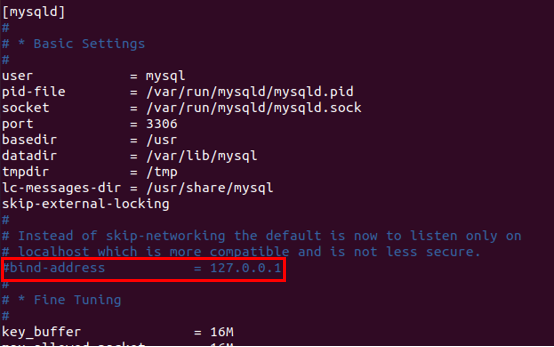
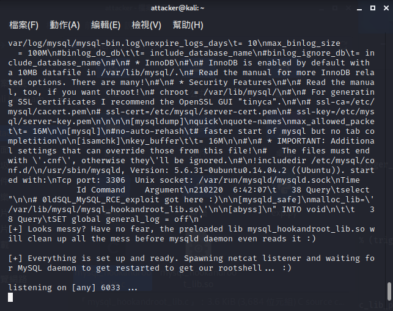
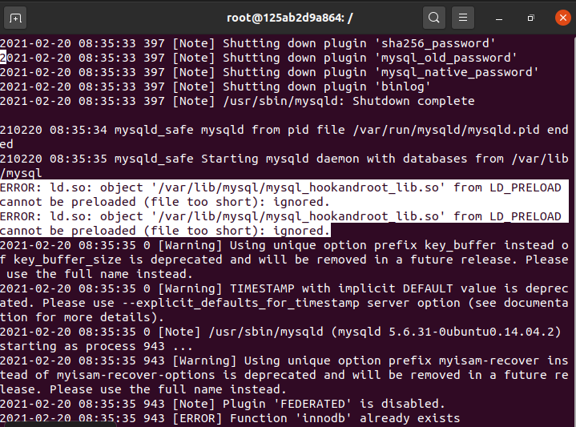

# 0x0 前言
本次沒有成功，做一下失敗的步驟紀錄，若只是我犯蠢，之後看的人可能可以看出來。

### CVE-2016-6662 Description  
Oracle **MySQL** through 5.5.52, 5.6.x through 5.6.33, and 5.7.x through 5.7.15; MariaDB before 5.5.51, 10.0.x before 10.0.27, and 10.1.x before 10.1.17; and Percona Server before 5.5.51-38.1, 5.6.x before 5.6.32-78.0, and 5.7.x before 5.7.14-7 allow local users to create arbitrary configurations and bypass certain protection mechanisms by setting **general_log_file** to a **my.cnf** configuration. NOTE: this can be leveraged to execute arbitrary code with root privileges by setting **malloc_lib**. NOTE: the affected MySQL version information is from Oracle's October 2016 CPU. Oracle has not commented on third-party claims that the issue was silently patched in MySQL 5.5.52, 5.6.33, and 5.7.15.

### MySQL (5.6.31)
MySQL is an open-source relational database management system (RDBMS).

### 原理簡介
---

* ()內為測試時使用之環境
* <>為可變動或需視使用環境變動的欄位
* `斜體字`為指令

# 0x1 前置需求
* 虛擬機軟體 (VMware Workstation 15.5.7)
* 攻擊機 (Kali Linux 2020.4)
* 受攻擊機 (Ubuntu 20.04)

# 0x2 受攻擊機環境建置
### 搭建MySQL 5.6.31伺服器
1. `sudo docker pull 0kami/cve-2016-6662`，pull受害環境image

2. `sudo docker run -it --rm --name cve-2016-6662 -p 3306:3306 0kami/cve-2016-6662`，將docker container架設在MySQL的3306 port，此時會進入shell  

3. **[重要]** `vi /etc/mysql/my.cnf`，將**bind-address**註解，否則無法從遠端access MySQL server  

4. `service mysql start`，啟動MySQL

### 設定MySQL
5. `mysql –u root -p`，進入MySQL

6. `CREATE DATABASE pocdb;`，建立database

7. `GRANT FILE ON *.* TO 'attacker'@'%' IDENTIFIED BY 'p0cpass!';`，建立使用者**attack/p0cpass!**，並賦予全域的FILE權限

8. ``GRANT SELECT, INSERT, CREATE ON \`pocdb\`.* TO 'attacker'@'%';``，給予attacker使用者在pocdb上SELECT、INSERT、CREATE的權限

9. `exit`，離開MySQL

### 設定權限
10. **[重要]** `chown -R mysql:mysql /etc/mysql/my.cnf`，設定my.cnf的owner權限，否則expoit script會失敗

# 0x3 攻擊機環境建置
1. `grep -r datadir /etc/mysql/`，查看datadir  

2. 建立exp.py: https://legalhackers.com/exploits/0ldSQL_MySQL_RCE_exploit.py ，182行處%s前改為datadir(下圖)，**[重要]** 159行與170行處的[mysqld]改為[mysqld_safe]，雖然網路上的PoC都是[mysqld]，但我的測試情況會報錯unknown variable "malloc_lib"，推測是5.6.31版本的[mysqld]沒有malloc_lib這個參數  

3. 建立mysql_hookandroot_lib.c: https://legalhackers.com/exploits/mysql_hookandroot_lib.c ，63,64,65行處改為攻擊機IP、6033 port、受害機my.cnf路徑(/etc/mysql/my.cnf)  

4. `python3 exp.py -dbuser attacker -dbpass p0cpass! -dbhost <受害機IP> -dbname pocdb -mycnf /etc/mysql/my.cnf`，若步驟皆正確會進入listen模式  

5. **[失敗處]** 正常情況此時回到受害機，`service mysql restart`重啟MySQL後就會反彈shell，但我的情況是雖可以成功重啟MySQL，但`vi /var/log/mysql/error.log`查看log發現報錯`ERROR: ld.so: object '/var/lib/mysql/mysql_hookandroot_lib.so' from LD_PRELOAD cannot be preloaded (file too short): ignored.`，無法被preload  
  
但使用`/usr/bin/mysqld_safe`檢查發現/var/lib/mysql/mysql_hookandroot_lib.so是有被寫入**LD_PRELOAD**的，但不知為何無法被preload，推測是MySQL的問題，而上網找沒有找到解法  

# 0x4 Snort/Suricata Rule
1. alert tcp $EXTERNAL_NET any -> $SQL_SERVERS 3306 (msg:"SERVER-MYSQL Multiple SQL products privilege escalation attempt"; flow:to_server,established; content:"set "; content:"global "; within:15; content:"general_log_file"; within:35; content:"/my.cnf"; within:100; pcre:"/set\s+global\s+general_log_file\s+=\s+[\x22\x27][^\x22\x27]{0,100}my\.cnf[\x22\x27]/si"; metadata:policy max-detect-ips drop, policy security-ips drop, service http; reference:cve,2016-6662; classtype:attempted-admin; sid:40254; rev:2;)

2. alert tcp $EXTERNAL_NET any -> $SQL_SERVERS 3306 (msg:"SERVER-MYSQL Multiple SQL products privilege escalation attempt"; flow:to_server,established; content:"select "; nocase; content:"malloc_lib="; within:100; nocase; content:".so"; within:50; nocase; pcre:"/select [\x22\x27][^\x22\x27]{0,100}malloc_lib=\S+\.so[\x22\x27]/si"; metadata:policy max-detect-ips drop, policy security-ips drop, service http; reference:cve,2016-6662; classtype:attempted-admin; sid:40253; rev:2;)

# 0x5 Reference
* http://avfisher.win/archives/tag/cve-2016-6662
* https://blog.csdn.net/yabingshi_tech/article/details/52638725
* https://blog.0kami.cn/2016/09/18/old-old-cve-2016-6663-mysql-exp/
* https://www.tecmint.com/fix-error-2003-hy000-cant-connect-to-mysql-server-on-127-0-0-1-111/

