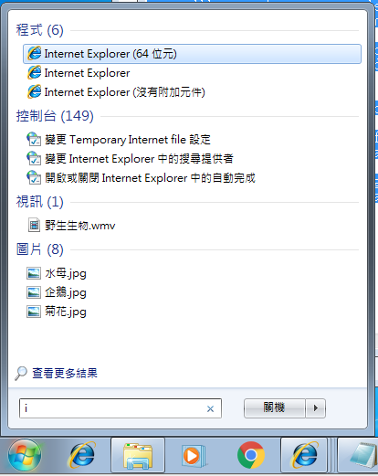
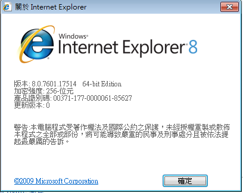
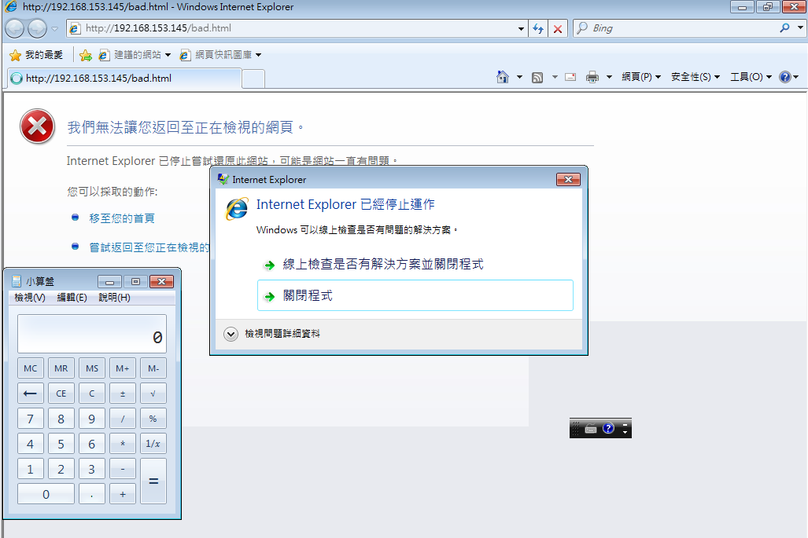

# 0x0 前言
### CVE-2020-0674 Description  
Microsoft **Internet Explorer** could allow a remote malicious user to execute arbitrary code on the system, caused by improper handling of objects in memory by the scripting engine. By persuading a victim to open specially-crafted content, an attacker could exploit this vulnerability to execute arbitrary code on the system with privileges of the victim.

### IE (8.0.7601.17514 64-bit Edition)
Web browser developed by Microsoft.

### 原理簡介
The description for this bug is that a **use-after-free** exists in the **Array object's sort function** when a **callback function is executed**. The arguments for this function are not tracked by the **garbage collector** (GC) and so can be used to cause a use-after-free.  

[Example] The **sort** function call sort on an **array** with itself as a **callback**:
```javascript
function compare(untracked_1, untracked_2) {
    ...
    // Recursive call
    [0,0].sort(compare);
    ...
}
```

此處只是超級簡介，詳細原理可以參考Reference 3

### 情境
此處之情境為攻擊者架設一惡意網站，受害者若是使用符合版本的IE browser瀏覽，將被執行任意程式碼。

* ()內為測試時使用之環境
* <>為可變動或需視使用環境變動的欄位
* `斜體字`為指令


# 0x1 前置需求
* 虛擬機軟體 (VMware Workstation 15.5.7)
* 攻擊機 (Ubuntu 20.04)
* 受攻擊機 (Windows7 Professional x64)，iso: https://drive.google.com/file/d/18EH8wVG1q3b70DFrODfDBSsQH6FCer-t/view


# 0x2 受攻擊機環境建置
1. 安裝Windows，完成後開始處搜尋"i"，點選**Internet Explorer (64位元)**  


2. 點選**右上角問號** > **關於 Internet Explorer(A)**，確認大版本為8  
  



# 0x3 攻擊機環境建置
1. `sudo apt install php libapache2-mod-php php-common php-mbstring php-gd php-intl php-curl php-xml php-mysql php-pgsql php-mysql php-bcmath`，安裝web server

2. `cd /var/www/html/`，切換至web server家目錄

3. `sudo touch <任意檔名(bad.html)>; sudo vi bad.html`，建立惡意檔案: https://github.com/maxpl0it/CVE-2020-0674-Exploit/blob/master/exploit.html

# 0x4 Exploit
4. 回到受攻擊機，開啟**Internet Explorer (64位元)**，於網址列輸入`<攻擊機IP>/bad.html`，可以看到跳出小算盤



# 0x5 後記
嘗試將bad.html中command執行的\u6163\u636c\u652e\u6578(calc.exe)改為\u6d63\u2e64\u7865\u0065(cmd.exe)或\u6364\u7763\u652e\u6578(dccw.exe)皆無法成功，只有calc.exe可以成功，不知道問題出在哪，在explioit script原作者的githib上有issue在討論，但還沒有解法：
1. https://github.com/maxpl0it/CVE-2020-0674-Exploit/issues/3 原作者沒有特別提到command有什麼限制
2. https://github.com/maxpl0it/CVE-2020-0674-Exploit/issues/4 原作者尚未回覆


# 0x6 Snort/Suricata Rule
1. alert tcp $EXTERNAL_NET any -> $SMTP_SERVERS 25 (msg:"BROWSER-IE Microsoft Internet Explorer JavaScript engine memory corruption attempt"; flow:to_server,established; file_data; content:"Jscript.Encode"; fast_pattern:only; content:"new Array("; content:"CollectGarbage()"; content:"typeof"; within:20; content:"new Object("; distance:0; metadata:policy balanced-ips drop, policy max-detect-ips drop, policy security-ips drop, service smtp; reference:cve,2020-0674; reference:url,portal.msrc.microsoft.com/en-US/security-guidance/advisory/CVE-2020-0674; classtype:attempted-user; sid:54400; rev:1;)

2. alert tcp $EXTERNAL_NET $FILE_DATA_PORTS -> $HOME_NET any (msg:"BROWSER-IE Microsoft Internet Explorer JavaScript engine memory corruption attempt"; flow:to_client,established; file_data; content:"Jscript.Encode"; fast_pattern:only; content:"new Array("; content:"CollectGarbage()"; content:"typeof"; within:20; content:"new Object("; distance:0; metadata:policy balanced-ips drop, policy max-detect-ips drop, policy security-ips drop, service ftp-data, service http, service imap, service pop3; reference:cve,2020-0674; reference:url,portal.msrc.microsoft.com/en-US/security-guidance/advisory/CVE-2020-0674; classtype:attempted-user; sid:54399; rev:1;)

3. alert tcp $EXTERNAL_NET any -> $SMTP_SERVERS 25 (msg:"BROWSER-IE Microsoft Internet Explorer JavaScript engine memory corruption attempt"; flow:to_server,established; file_data; content:"new"; content:"Enumerator"; within:25; fast_pattern; content:"CollectGarbage()"; content:"fromCharCode"; content:"RegExp"; metadata:policy balanced-ips drop, policy max-detect-ips drop, policy security-ips drop, service smtp; reference:cve,2018-8653; reference:cve,2019-1367; reference:cve,2020-0674; reference:url,portal.msrc.microsoft.com/en-US/security-guidance/advisory/CVE-2018-8653; reference:url,portal.msrc.microsoft.com/en-US/security-guidance/advisory/CVE-2019-1367; classtype:attempted-user; sid:48702; rev:3;)

4. alert tcp $EXTERNAL_NET $FILE_DATA_PORTS -> $HOME_NET any (msg:"BROWSER-IE Microsoft Internet Explorer JavaScript engine memory corruption attempt"; flow:to_client,established; file_data; content:"new"; content:"Enumerator"; within:25; fast_pattern; content:"CollectGarbage()"; content:"fromCharCode"; content:"RegExp"; metadata:policy balanced-ips drop, policy max-detect-ips drop, policy security-ips drop, service ftp-data, service http, service imap, service pop3; reference:cve,2018-8653; reference:cve,2019-1367; reference:cve,2020-0674; reference:url,portal.msrc.microsoft.com/en-US/security-guidance/advisory/CVE-2018-8653; reference:url,portal.msrc.microsoft.com/en-US/security-guidance/advisory/CVE-2019-1367; classtype:attempted-user; sid:48701; rev:3;)


# 0x7 Reference
* https://github.com/maxpl0it/CVE-2020-0674-Exploit
* https://twitter.com/maxpl0it/status/1253396942048104448
* https://labs.f-secure.com/blog/internet-exploiter-understanding-vulnerabilities-in-internet-explorer/


