# 0x0 前言
### ProxyLogon  
https://www.praetorian.com/blog/reproducing-proxylogon-exploit/

### Exchange Server
Microsoft Exchange Server is a mail server and calendaring server developed by Microsoft. It runs exclusively on Windows Server operating systems.

* ()內為測試時使用之環境
* <>為可變動或需視使用環境變動的欄位
* `斜體字`為指令

# 0x1 前置需求
* 虛擬機軟體 (VMware Workstation 15.5.7)
* 攻擊機 (Kali Linux 2020.4)
* 受攻擊機 (Windows Server 2012 r2)

# 0x2 受攻擊機環境建置
## 搭建Exchange Server 2013

### 安裝相依套件
1. 開啟powershell，輸入`Install-WindowsFeature AS-HTTP-Activation, Desktop-Experience, NET-Framework-45-Features, RPC-over-HTTP-proxy, RSAT-Clustering, RSAT-Clustering-CmdInterface, Web-Mgmt-Console, WAS-Process-Model, Web-Asp-Net45, Web-Basic-Auth, Web-Client-Auth, Web-Digest-Auth, Web-Dir-Browsing, Web-Dyn-Compression, Web-Http-Errors, Web-Http-Logging, Web-Http-Redirect, Web-Http-Tracing, Web-ISAPI-Ext, Web-ISAPI-Filter, Web-Lgcy-Mgmt-Console, Web-Metabase, Web-Mgmt-Console, Web-Mgmt-Service, Web-Net-Ext45, Web-Request-Monitor, Web-Server, Web-Stat-Compression, Web-Static-Content, Web-Windows-Auth, Web-WMI, Windows-Identity-Foundation`  
和  
`Install-WindowsFeature AS-HTTP-Activation, Desktop-Experience, NET-Framework-45-Features, RPC-over-HTTP-proxy, RSAT-Clustering, Web-Mgmt-Console, WAS-Process-Model, Web-Asp-Net45, Web-Basic-Auth, Web-Client-Auth, Web-Digest-Auth, Web-Dir-Browsing, Web-Dyn-Compression, Web-Http-Errors, Web-Http-Logging, Web-Http-Redirect, Web-Http-Tracing, Web-ISAPI-Ext, Web-ISAPI-Filter, Web-Lgcy-Mgmt-Console, Web-Metabase, Web-Mgmt-Console, Web-Mgmt-Service, Web-Net-Ext45, Web-Request-Monitor, Web-Server, Web-Stat-Compression, Web-Static-Content, Web-Windows-Auth, Web-WMI, Windows-Identity-Foundation`

### 安裝相依程式
2. 下載Microsoft Office 2010 Filter Packs 64-bit (https://www.microsoft.com/en-us/download/details.aspx?id=17062) 並安裝
3. 下載Microsoft Office 2010 Filter Packs SP2 64-bit (https://www.microsoft.com/en-us/download/details.aspx?id=39668) 並安裝
4. 下載Microsoft Unified Communications Managed API 4.0, Core Runtime 64-bit (https://www.microsoft.com/zh-tw/download/details.aspx?id=34992) 並安裝
5. 下載.NET Framework 4.7.2 Runtime (https://dotnet.microsoft.com/download/dotnet-framework/net472) 並安裝
6. 下載Visual C++ 2013 Redistributable Package (https://www.microsoft.com/zh-TW/download/details.aspx?id=40784) 並安裝

### 安裝AD DS
7. 參考CVE-2020-17144 step 4 ~ step 29

### 安裝Exchange Server 2013
8. 下載Exchange Server (https://www.microsoft.com/en-us/download/details.aspx?id=58392) 並解壓縮，執行setup

9. Next  
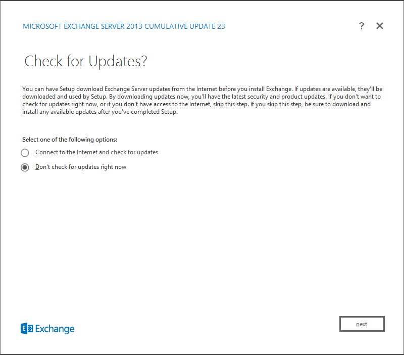

10. Next  
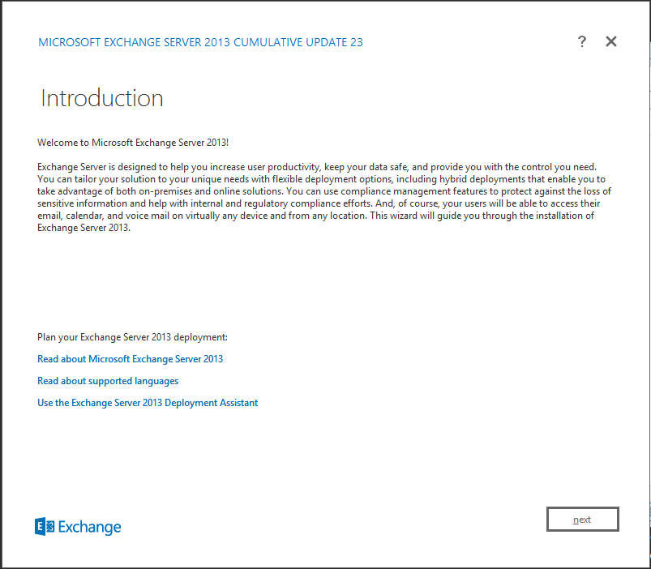

11. Next  
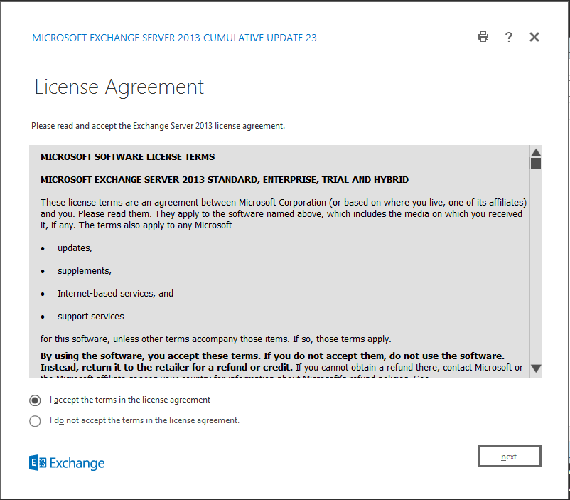

12. Next  
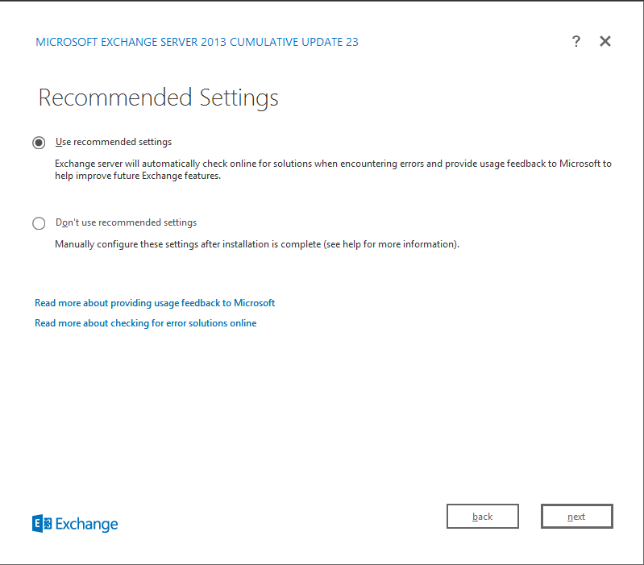

13. 勾選**Mailbox role**和**Client Access role** > Next  
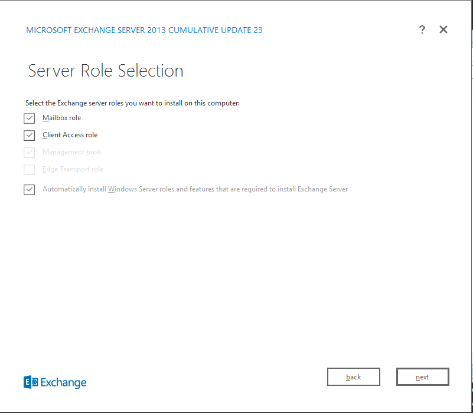

14. Next  
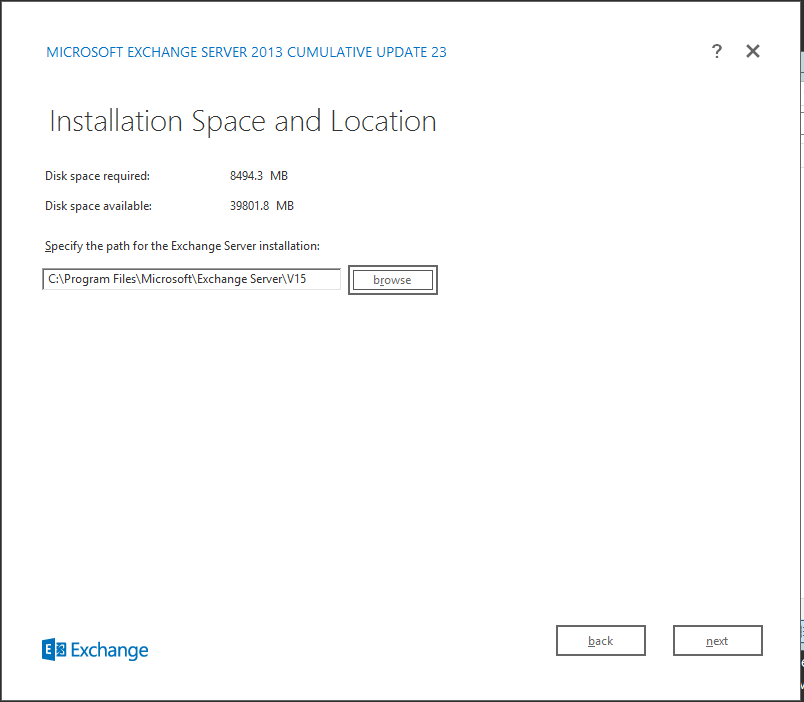

15. 隨意 > Next  

16. Next  
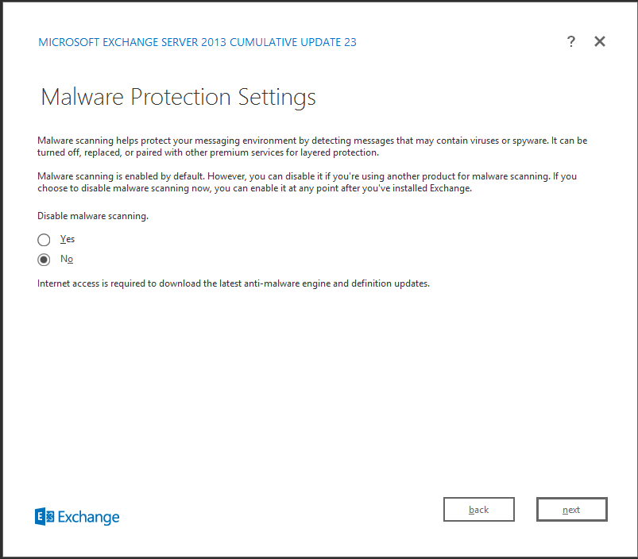

17. 前面沒漏做應該可以Install  
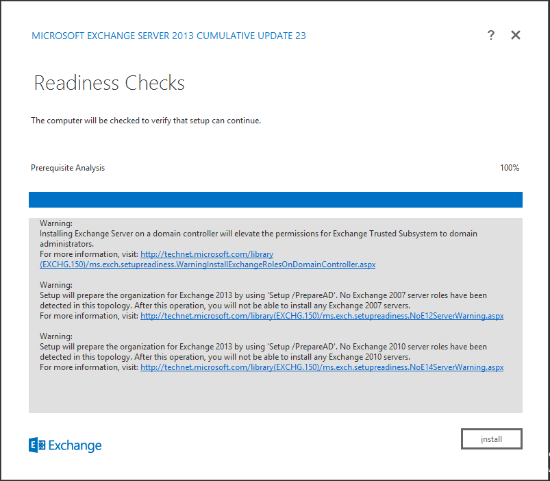

18. Finish  
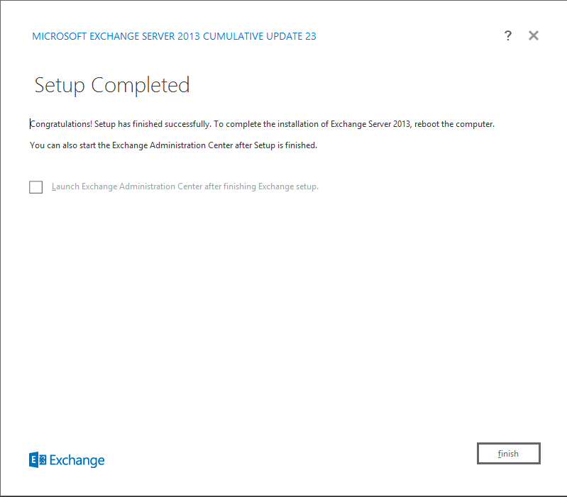

19. 重開機後開啟瀏覽器，於網址列輸入`https://127.0.0.1`，可以看到登入畫面  
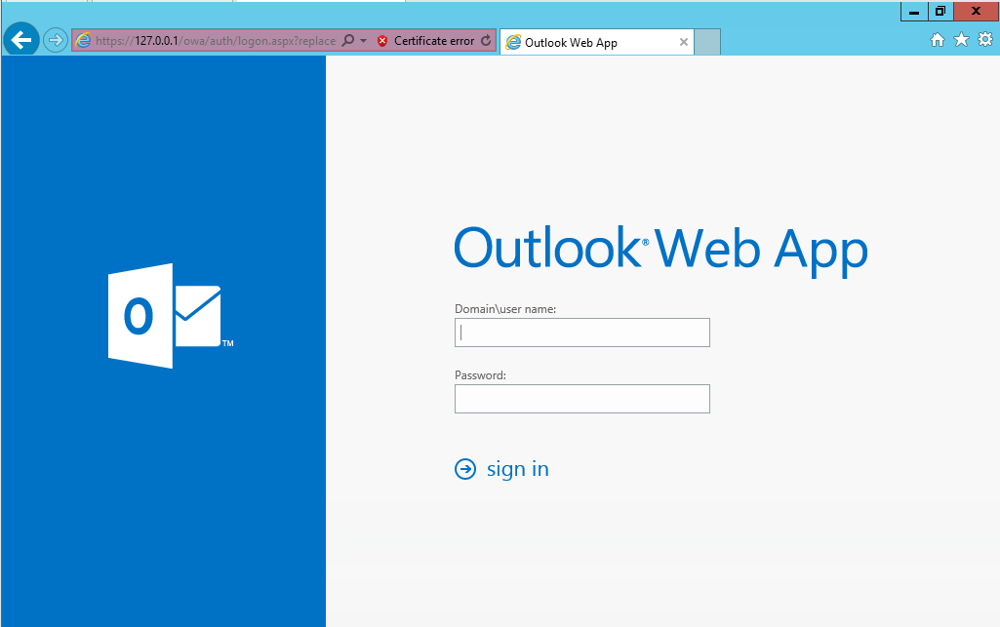

# 0x3 攻擊機環境建置
1. 至 https://github.com/hausec/ProxyLogon/blob/main/proxylogon.py 下載script

### Terminal
2. `python3 exp.py <受攻擊機IP> Administrator@vulner.com`，但跳出Connection Reset Error，錯在requests.get()，但是我是可以get http://google.com 的，也能夠用瀏覽器瀏覽`https://192.168.153.141`，所以很可能是Windows Server這邊不知道還有什麼需要設定才能用request的方式access  
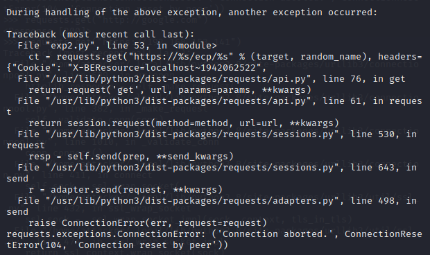  

# 0x4 Snort/Suricata Rule
1. rule 1

# 0x5 Reference
* Reference 1

